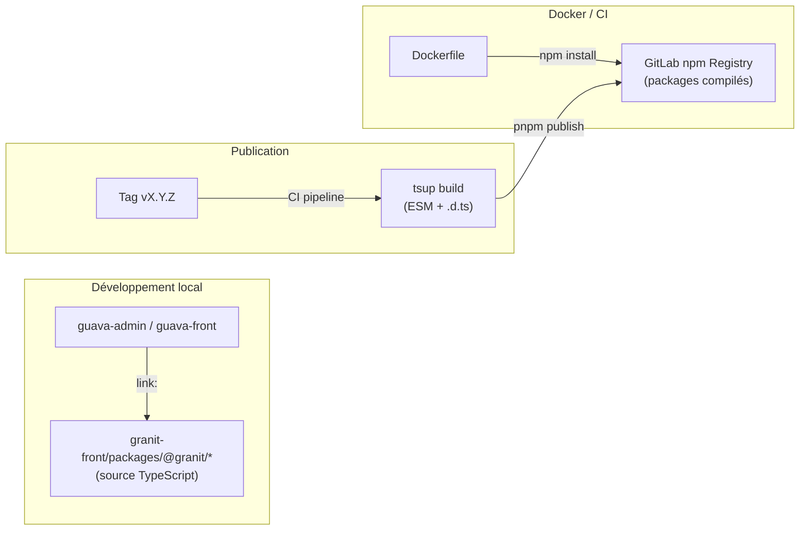

# Registry npm GitLab — Publication des packages @granit/*

## Vue d'ensemble

Les packages `@granit/*` sont publiés sur le **GitLab npm package registry**
du projet granit-front. Une stratégie hybride permet de conserver le
développement local performant (hot-reload) tout en supportant les builds
Docker et CI/CD autonomes.



## Stratégie hybride

| Contexte | Résolution | Source | Hot-reload |
| --- | --- | --- | --- |
| Développement local | `link:` + aliases Vite | TypeScript source | Oui |
| Docker / CI | Registry npm GitLab | JavaScript compilé + `.d.ts` | Non |

### Développement local

Les applications utilisent `link:` dans `package.json` pour pointer vers
le source TypeScript des packages :

```json
{
  "dependencies": {
    "@granit/logger": "link:../../../granit-front/packages/@granit/logger"
  }
}
```

Combiné avec les aliases Vite (`vite.config.ts`), cela permet le hot-reload
instantané lors de modifications dans granit-front.

### Docker / CI

En Docker, le répertoire `granit-front` n'existe pas. Le Dockerfile :

1. Copie le `.npmrc` (scope `@granit` → registry GitLab)
2. Remplace les dépendances `link:` par `*` (résolution registry)
3. Injecte le token d'authentification via `--build-arg NPM_TOKEN`
4. Installe les packages compilés depuis le registry

## Publication

### Versioning

Les packages suivent le **semantic versioning** (semver). Tous les packages
partagent la même version, alignée sur les tags Git du projet granit-front.

### Publication automatique (CI)

La publication est déclenchée par un **tag Git** au format `vX.Y.Z` :

```bash
git tag v0.1.0
git push origin v0.1.0
```

Le pipeline CI exécute :

1. `quality` : lint + typecheck
2. `test` : tests unitaires
3. `build` : `tsup` (ESM + `.d.ts`) pour chaque package
4. `publish` : `pnpm -r publish` vers le registry GitLab

L'authentification utilise le `CI_JOB_TOKEN` (automatique, pas de secret
à configurer).

### Publication manuelle (développement)

Pour publier manuellement (déconseillé en production) :

```bash
# Créer un deploy token dans GitLab > Settings > Repository > Deploy tokens
# Scope : write_package_registry

# Build
pnpm build

# Configurer le token
echo "//gitlab.digitaldynamics.be/api/v4/projects/9/packages/npm/:_authToken=<DEPLOY_TOKEN>" >> .npmrc

# Publier
pnpm -r publish --no-git-checks --access restricted
```

## Configuration des consommateurs

### Fichier `.npmrc`

Chaque application consommatrice doit avoir un `.npmrc` :

```ini
@granit:registry=https://gitlab.digitaldynamics.be/api/v4/projects/9/packages/npm/
```

### Aliases Vite (conditionnels)

Les aliases `@granit/*` dans `vite.config.ts` sont **conditionnels** :
ils ne s'appliquent que si le répertoire `granit-front` local existe.

```typescript
import fs from 'fs';

const GRANIT = path.resolve(__dirname, '../../../granit-front/packages/@granit');
const useLocalGranit = fs.existsSync(GRANIT);

// En dev local : aliases vers le source TypeScript (hot-reload)
// En Docker/CI : pas d'aliases, résolution via node_modules (registry)
```

### Build Docker

```bash
docker build \
  --build-arg NPM_TOKEN=<deploy-token-ou-ci-job-token> \
  -t guava-admin .
```

En CI, le `CI_JOB_TOKEN` est utilisé automatiquement.

## Architecture des packages

### Build (tsup)

Chaque package est compilé avec **tsup** :

- **Format** : ESM uniquement
- **Sortie** : `dist/index.js` + `dist/index.d.ts`
- **Externalisations** : `@granit/*` (inter-packages), `peerDependencies`

La configuration tsup est dans `tsup.config.ts` de chaque package.
Le `tsconfig.build.json` à la racine gère les options d'émission.

### publishConfig

Le `package.json` de chaque package utilise `publishConfig` pour séparer
les exports locaux (source) des exports publiés (compilés) :

```json
{
  "exports": {
    ".": "./src/index.ts"
  },
  "publishConfig": {
    "exports": {
      ".": {
        "types": "./dist/index.d.ts",
        "import": "./dist/index.js"
      }
    },
    "registry": "https://gitlab.digitaldynamics.be/api/v4/projects/9/packages/npm/"
  }
}
```

- **Localement** : `exports` pointe vers le source TypeScript
- **Publié** : `publishConfig.exports` remplace et pointe vers `dist/`

## Dépannage

### Package non trouvé sur le registry

Vérifier que le package a été publié :

```bash
npm view @granit/logger --registry=https://gitlab.digitaldynamics.be/api/v4/projects/9/packages/npm/
```

Ou vérifier dans GitLab : **granit-front > Packages and registries > Package registry**.

### Erreur d'authentification (401/403)

- Vérifier que le `.npmrc` contient le bon `_authToken`
- En CI : le `CI_JOB_TOKEN` est automatique, pas de configuration nécessaire
- En local : utiliser un deploy token avec le scope `read_package_registry`

### Version incompatible

Si `pnpm install` échoue avec une erreur de version :

1. Vérifier la version publiée dans le registry
2. Mettre à jour la version dans le `package.json` du consommateur
3. Ou utiliser `*` pour toujours prendre la dernière version

### Build Docker échoue sur les packages @granit/*

1. Vérifier que `--build-arg NPM_TOKEN=xxx` est passé au `docker build`
2. Vérifier que les packages sont publiés sur le registry
3. Vérifier que le `.npmrc` est copié dans le stage `deps` (pas exclu par `.dockerignore`)
