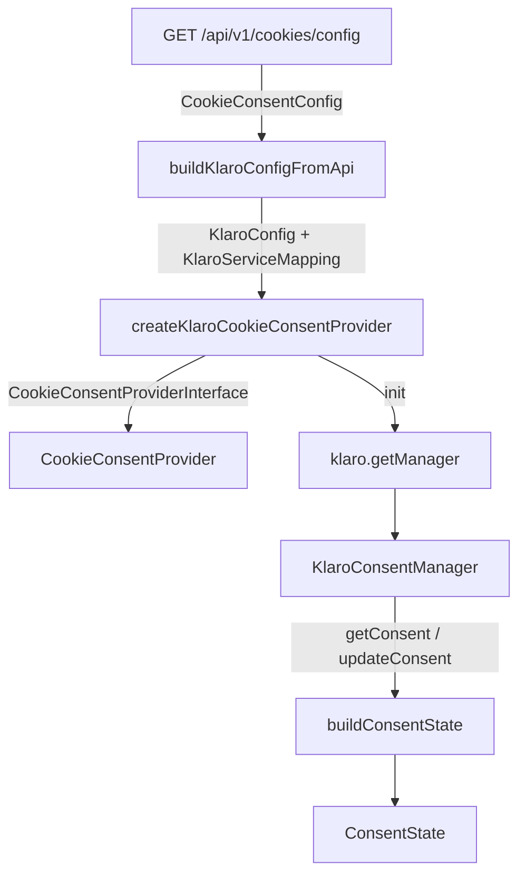

# @granit/cookies-klaro

Adaptateur [Klaro](https://github.com/kiprotect/klaro) pour `@granit/cookies`. Implémente l'interface `CookieConsentProviderInterface` en déléguant au Klaro Consent Manager.

## Pourquoi

- Intégration Klaro sans couplage : le reste de l'application consomme uniquement `@granit/cookies`
- Deux modes de configuration : statique (config embarquée) ou dynamique (chargée depuis l'API)
- Conversion automatique de la configuration backend (`CookieConsentConfig`) en configuration Klaro
- Logique all-or-nothing par catégorie RGPD (cohérente avec le backend)

## Architecture



La factory `createKlaroCookieConsentProvider` retourne un objet conforme à `CookieConsentProviderInterface`. À l'initialisation (`init()`), elle charge Klaro dynamiquement (`klaro/dist/klaro-no-css`) et crée un `KlaroConsentManager`.

## Configuration

### Mode dynamique (recommandé)

La configuration est chargée depuis l'API backend à l'initialisation :

```typescript
import { createKlaroCookieConsentProvider } from '@granit/cookies-klaro';

const provider = createKlaroCookieConsentProvider({
  loadConfig: () => apiClient.get('/cookies/config').then((r) => r.data),
  cookieName: 'klaro',
});
```

L'adaptateur convertit automatiquement la réponse `CookieConsentConfig` en configuration Klaro et en mappings de services.

### Mode statique

La configuration Klaro et les mappings sont fournis directement :

```typescript
import { createKlaroCookieConsentProvider } from '@granit/cookies-klaro';

const provider = createKlaroCookieConsentProvider({
  klaroConfig: {
    cookieName: 'klaro',
    services: [
      { name: 'matomo', purposes: ['analytics'], cookies: [/^_pk_/] },
      { name: 'hotjar', purposes: ['analytics'], cookies: [/^_hj/] },
    ],
  },
  serviceMappings: [
    { name: 'matomo', category: 'analytics' },
    { name: 'hotjar', category: 'analytics' },
  ],
});
```

### `CreateKlaroCookieConsentProviderOptions`

| Option            | Type                                 | Défaut    | Description                                                  |
| ----------------- | ------------------------------------ | --------- | ------------------------------------------------------------ |
| `loadConfig`      | `() => Promise<CookieConsentConfig>` | —         | Charge la configuration depuis l'API (mode dynamique)        |
| `klaroConfig`     | `KlaroConfig`                        | —         | Configuration Klaro complète (mode statique)                 |
| `serviceMappings` | `KlaroServiceMapping[]`              | `[]`      | Mapping service Klaro → catégorie RGPD (mode statique)       |
| `cookieName`      | `string`                             | `'klaro'` | Nom du cookie utilisé par Klaro pour stocker le consentement |

Quand `loadConfig` est fourni, `klaroConfig` et `serviceMappings` sont ignorés.

## Types

### `KlaroConfig`

```typescript
interface KlaroConfig {
  readonly elementID?: string;
  readonly cookieName?: string;
  readonly services: ReadonlyArray<{
    readonly name: string;
    readonly purposes: readonly string[];
    [key: string]: unknown;
  }>;
  [key: string]: unknown;
}
```

Sous-ensemble minimal de la configuration Klaro utilisé par l'adaptateur. Accepte toute propriété Klaro supplémentaire.

### `KlaroServiceMapping`

```typescript
interface KlaroServiceMapping {
  readonly name: string;
  readonly category: CookieCategory;
}
```

Associe un service Klaro à une catégorie RGPD. Utilisé pour convertir les consentements Klaro (par service) en consentements par catégorie.

### `KlaroConsentManager`

```typescript
interface KlaroConsentManager {
  getConsent(name: string): boolean;
  updateConsent(name: string, value: boolean): boolean;
  changeAll(value: boolean): number;
  saveAndApplyConsents(): void;
  watch(watcher: KlaroWatcher): void;
}
```

Interface interne du consent manager Klaro (sous-ensemble typé).

### `KlaroWatcher`

```typescript
interface KlaroWatcher {
  update(obj: unknown, name: string, data: unknown): void;
}
```

Observateur de changements de consentement Klaro.

## Comportement interne

### Logique all-or-nothing par catégorie

Le consentement d'une catégorie est considéré comme accordé uniquement si **tous** les services de cette catégorie sont acceptés. Si un seul service est refusé, la catégorie entière est considérée comme refusée.

### `strictly_necessary` toujours activée

La catégorie `strictly_necessary` est toujours `true` et ne peut pas être modifiée via `setConsent`.

### Détection du consentement existant

`hasConsented()` vérifie la présence du cookie Klaro (par défaut `klaro`) dans `document.cookie`.

## Exemple complet

```tsx
import { CookieConsentProvider, useCookieConsent } from '@granit/cookies';
import { createKlaroCookieConsentProvider } from '@granit/cookies-klaro';
import { createApiClient } from '@granit/api-client';

const apiClient = createApiClient({ baseURL: '/api/v1' });

// Créer le provider Klaro en mode dynamique
const klaroProvider = createKlaroCookieConsentProvider({
  loadConfig: () => apiClient.get('/cookies/config').then((r) => r.data),
  cookieName: 'klaro',
});

function CookieSettings() {
  const { consents, isLoaded, acceptCategory, revokeCategory } = useCookieConsent();

  if (!isLoaded) return <p>Chargement…</p>;

  return (
    <div>
      <h2>Paramètres des cookies</h2>
      <label>
        <input type="checkbox" checked disabled />
        Cookies essentiels (toujours actifs)
      </label>
      <label>
        <input
          type="checkbox"
          checked={consents.analytics}
          onChange={(e) =>
            e.target.checked ? acceptCategory('analytics') : revokeCategory('analytics')
          }
        />
        Cookies analytiques
      </label>
      <label>
        <input
          type="checkbox"
          checked={consents.marketing}
          onChange={(e) =>
            e.target.checked ? acceptCategory('marketing') : revokeCategory('marketing')
          }
        />
        Cookies marketing
      </label>
    </div>
  );
}

function App() {
  return (
    <CookieConsentProvider provider={klaroProvider}>
      <CookieSettings />
    </CookieConsentProvider>
  );
}
```

## Peer dependencies

- `react` ^19.0.0
- `klaro` — Klaro CMP (chargé dynamiquement via `klaro/dist/klaro-no-css`)
- `@granit/cookies` — Interface et types de consentement
