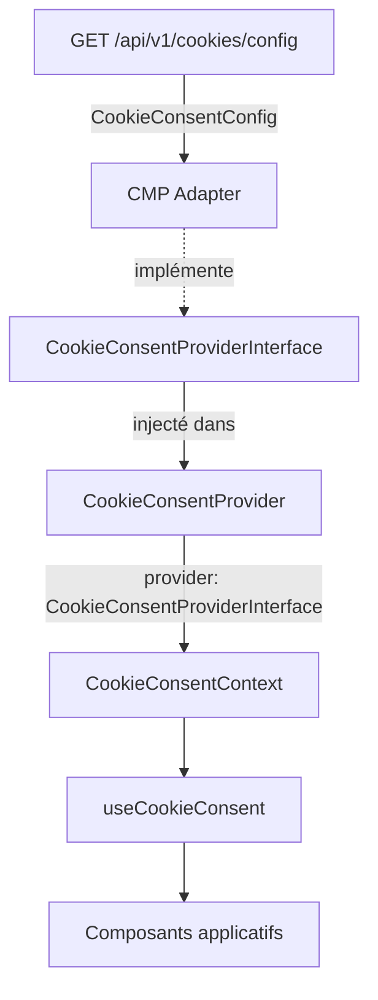

# @granit/cookies

Abstraction RGPD de gestion du consentement cookies, indépendante du CMP (Consent Management Platform). Définit l'interface commune et le contexte React consommé par les composants applicatifs.

## Pourquoi

- Abstraction CMP-agnostique : Klaro, Cookiebot, ou toute implémentation custom
- Conformité RGPD avec 4 catégories de cookies normalisées
- Contexte React pour accéder à l'état du consentement dans tout l'arbre de composants
- Contrat typé entre le backend (registre de cookies) et le front (bandeau de consentement)

## Architecture



Le `CookieConsentProvider` initialise le CMP via l'interface `CookieConsentProviderInterface`, puis expose l'état du consentement et les actions à tous les composants enfants via un contexte React.

## Configuration

### `CookieConsentProvider`

Wrappez les composants qui consomment le consentement dans un `CookieConsentProvider` :

```tsx
import { CookieConsentProvider } from '@granit/cookies';
import { createKlaroCookieConsentProvider } from '@granit/cookies-klaro';

const klaroProvider = createKlaroCookieConsentProvider({
  loadConfig: () => apiClient.get('/cookies/config').then((r) => r.data),
});

function App() {
  return (
    <CookieConsentProvider provider={klaroProvider}>
      <MainLayout />
    </CookieConsentProvider>
  );
}
```

| Prop       | Type                             | Défaut | Description                                         |
| ---------- | -------------------------------- | ------ | --------------------------------------------------- |
| `provider` | `CookieConsentProviderInterface` | —      | Implémentation CMP (Klaro, Cookiebot, custom, etc.) |
| `children` | `ReactNode`                      | —      | Arbre de composants enfants                         |

## Hooks

### `useCookieConsent(): CookieConsentContextValue`

Accède à l'état du consentement et aux actions. Doit être utilisé dans un composant enfant de `CookieConsentProvider`.

```tsx
const { consents, isLoaded, hasConsented, acceptCategory, revokeCategory, acceptAll, revokeAll } =
  useCookieConsent();

if (!isLoaded) return <Spinner />;

if (consents.analytics) {
  // Charger les scripts analytics
}
```

#### Retour (`CookieConsentContextValue`)

| Propriété        | Type                                 | Description                                                         |
| ---------------- | ------------------------------------ | ------------------------------------------------------------------- |
| `consents`       | `ConsentState`                       | État du consentement par catégorie                                  |
| `isLoaded`       | `boolean`                            | `true` quand le CMP est initialisé                                  |
| `hasConsented`   | `boolean`                            | `true` si l'utilisateur a déjà fait un choix                        |
| `acceptCategory` | `(category: CookieCategory) => void` | Accorde le consentement pour une catégorie                          |
| `revokeCategory` | `(category: CookieCategory) => void` | Révoque le consentement pour une catégorie                          |
| `acceptAll`      | `() => void`                         | Accorde le consentement pour toutes les catégories                  |
| `revokeAll`      | `() => void`                         | Révoque le consentement pour toutes les catégories non essentielles |

## Types

### `CookieCategory`

```typescript
type CookieCategory = 'strictly_necessary' | 'preferences' | 'analytics' | 'marketing';
```

Les 4 catégories RGPD normalisées. `strictly_necessary` est toujours activée et ne peut pas être révoquée.

### `ConsentState`

```typescript
type ConsentState = Record<CookieCategory, boolean>;
```

État du consentement pour chaque catégorie.

### `CookieConsentProviderInterface`

```typescript
interface CookieConsentProviderInterface {
  init(): Promise<void>;
  getConsents(): ConsentState;
  onConsentChange(callback: (consents: ConsentState) => void): () => void;
  setConsent(category: CookieCategory, granted: boolean): void;
  setAllConsents(granted: boolean): void;
  hasConsented(): boolean;
}
```

Interface à implémenter par chaque adaptateur CMP. Voir `@granit/cookies-klaro` pour l'implémentation Klaro.

| Méthode           | Description                                                         |
| ----------------- | ------------------------------------------------------------------- |
| `init`            | Initialise le CMP (charge le SDK, lit le consentement existant)     |
| `getConsents`     | Retourne l'état courant du consentement                             |
| `onConsentChange` | S'abonne aux changements de consentement, retourne un unsubscribe   |
| `setConsent`      | Définit le consentement pour une catégorie et le persiste           |
| `setAllConsents`  | Définit le consentement pour toutes les catégories non essentielles |
| `hasConsented`    | `true` si l'utilisateur a déjà fait un choix de consentement        |

### `CookieConsentConfig`

```typescript
interface CookieConsentConfig {
  readonly cookies: readonly CookieDefinitionDto[];
  readonly services: readonly ThirdPartyServiceDto[];
}
```

Réponse de l'API `GET /api/v1/cookies/config`. Contrat CMP-agnostique entre le backend et tout adaptateur CMP.

### `CookieDefinitionDto`

```typescript
interface CookieDefinitionDto {
  readonly name: string;
  readonly category: CookieCategory;
  readonly retentionDays: number;
  readonly purpose: string;
}
```

Définition d'un cookie interne enregistré par l'application.

### `ThirdPartyServiceDto`

```typescript
interface ThirdPartyServiceDto {
  readonly name: string;
  readonly category: CookieCategory;
  readonly cookiePatterns: readonly string[];
}
```

Service tiers qui dépose des cookies sur le client. Les `cookiePatterns` sont des expressions régulières pour identifier les cookies associés.

## API REST consommée

| Méthode | Endpoint                 | Description                                                  |
| ------- | ------------------------ | ------------------------------------------------------------ |
| `GET`   | `/api/v1/cookies/config` | Configuration des cookies et services tiers (CMP-agnostique) |

## Exemple complet

```tsx
import { CookieConsentProvider, useCookieConsent } from '@granit/cookies';
import { createKlaroCookieConsentProvider } from '@granit/cookies-klaro';

// 1. Créer l'adaptateur CMP (Klaro)
const klaroProvider = createKlaroCookieConsentProvider({
  loadConfig: () => apiClient.get('/cookies/config').then((r) => r.data),
  cookieName: 'klaro',
});

// 2. Composant qui consomme le consentement
function AnalyticsLoader() {
  const { consents, isLoaded } = useCookieConsent();

  if (!isLoaded) return null;

  if (consents.analytics) {
    return <MatomoTracker />;
  }

  return null;
}

// 3. Bandeau de consentement personnalisé
function CookieBanner() {
  const { hasConsented, acceptAll, revokeAll } = useCookieConsent();

  if (hasConsented) return null;

  return (
    <div>
      <p>Nous utilisons des cookies pour améliorer votre expérience.</p>
      <button onClick={acceptAll}>Tout accepter</button>
      <button onClick={revokeAll}>Tout refuser</button>
    </div>
  );
}

// 4. Assemblage
function App() {
  return (
    <CookieConsentProvider provider={klaroProvider}>
      <CookieBanner />
      <AnalyticsLoader />
      <MainLayout />
    </CookieConsentProvider>
  );
}
```

## Peer dependencies

- `react` ^19.0.0
