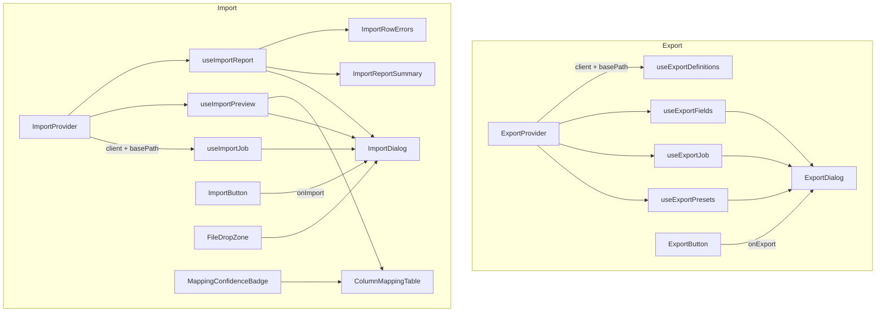

# @granit/data-exchange

Export et import tabulaires : sélection de colonnes, presets, jobs asynchrones, mapping intelligent, dry-run, rapport d'erreurs. Consomme l'API REST `Granit.DataExchange` (.NET).

## Pourquoi

- **Export** : sélection de colonnes, réordonnancement, choix du format (XLSX/CSV), presets sauvegardés, mode roundtrip (ID pour ré-import), propagation des filtres/tri/recherche courants
- **Import** : upload de fichier, prévisualisation, mapping automatique (Exact/Fuzzy/Semantic) + édition manuelle, dry-run de validation, exécution asynchrone avec polling, rapport détaillé, fichier de correction téléchargeable
- Providers séparés (`ExportProvider`, `ImportProvider`) pour des basePath indépendants
- Composants headless intégrés à `@granit/ui` (Dialog, Button, Table, Badge, Select, etc.)
- Cycle de vie complet géré par TanStack Query (mutations, polling, invalidation de cache)

## Architecture



Chaque provider :

1. Injecte la configuration (instance Axios + basePath) dans les hooks enfants via un contexte React
2. Fournit une factory de query keys pour TanStack Query (`buildExportQueryKey` / `buildImportQueryKey`)

## Configuration

### `ExportProvider`

Wrappez les composants qui utilisent les hooks d'export :

```tsx
import { ExportProvider } from '@granit/data-exchange';

function App() {
  return (
    <ExportProvider config={{
      client: apiClient,
      basePath: '/api/data-exchange/export',
    }}>
      <PatientList />
    </ExportProvider>
  );
}
```

### `ImportProvider`

Wrappez les composants qui utilisent les hooks d'import :

```tsx
import { ImportProvider } from '@granit/data-exchange';

function App() {
  return (
    <ImportProvider config={{
      client: apiClient,
      basePath: '/api/data-exchange/import',
    }}>
      <PatientImport />
    </ImportProvider>
  );
}
```

### Props de configuration (communes aux deux providers)

| Prop | Type | Defaut | Description |
| --- | --- | --- | --- |
| `config.client` | `AxiosInstance` | — | Instance Axios configuree (via `@granit/api-client`) |
| `config.basePath` | `string` | — | Prefixe des endpoints REST |
| `config.queryKeyPrefix` | `string[]` | `['data-export']` / `['data-import']` | Prefixe personnalise pour les query keys TanStack |

---

## Export

### Hooks

#### `useExportDefinitions(): UseQueryResult<ExportDefinitionResponse[]>`

Charge la liste des definitions d'export enregistrees. Cache longue duree (`staleTime: 5 min`).

```tsx
const { data: definitions } = useExportDefinitions();
// definitions[0].name          → 'Guava.PatientExport'
// definitions[0].entityType    → 'Patient'
// definitions[0].supportedFormats → ['xlsx', 'csv']
```

#### `useExportFields(definitionName?): UseQueryResult<ExportFieldDescriptor[]>`

Charge les champs disponibles pour une definition donnee. Cache longue duree.

```tsx
const { data: fields } = useExportFields('Guava.PatientExport');
// fields[0].propertyPath → 'Email'
// fields[0].header       → 'Email'
// fields[0].isNavigation → false
```

#### `useExportJob(): UseExportJobReturn`

Gere le cycle de vie complet d'un export : creation du job, polling du statut, telechargement automatique a la completion.

```tsx
const { startExport, job, isExporting, isCreating, error, reset } = useExportJob();

startExport({
  definitionName: 'Guava.PatientExport',
  format: 'xlsx',
  selectedFields: ['Email', 'FirstName', 'LastName'],
  includeIdForImport: false,
  sort: '-CreatedAt',
  filter: { 'Status.Eq': 'Active' },
  presets: null,
  search: null,
});
// → polling automatique → telechargement automatique quand status === 'Completed'
```

| Propriete | Type | Description |
| --- | --- | --- |
| `startExport` | `(request: CreateExportJobRequest) => void` | Lance un job d'export |
| `job` | `ExportJobResponse \| null` | Job en cours |
| `isExporting` | `boolean` | Job actif (polling en cours) |
| `isCreating` | `boolean` | Creation du job en cours |
| `error` | `Error \| null` | Erreur de creation ou de polling |
| `reset` | `() => void` | Remet l'etat a zero |

#### `useExportPresets(definitionName?): UseExportPresetsReturn`

CRUD complet pour les presets d'export avec invalidation du cache TanStack Query.

```tsx
const { presets, save, remove } = useExportPresets('Guava.PatientExport');

// Lister
const savedPresets = presets.data; // ExportPresetResponse[]

// Sauvegarder
save.mutate({
  definitionName: 'Guava.PatientExport',
  presetName: 'Monthly report',
  selectedFields: ['Email', 'FirstName', 'LastName', 'Status'],
  format: 'xlsx',
  includeIdForImport: false,
});

// Supprimer
remove.mutate('Monthly report');
```

| Propriete | Type | Description |
| --- | --- | --- |
| `presets` | `UseQueryResult<ExportPresetResponse[]>` | Presets sauvegardes |
| `save` | `UseMutationResult` | Mutation de sauvegarde |
| `remove` | `UseMutationResult` | Mutation de suppression |

### Composants

#### `<ExportButton />`

Bouton toolbar pour declencher l'ouverture du dialog d'export.

```tsx
<ExportButton onExport={() => setOpen(true)} label="Export" />
```

| Prop | Type | Defaut | Description |
| --- | --- | --- | --- |
| `onExport` | `() => void` | — | Callback au clic |
| `label` | `string` | `'Export'` | Texte du bouton |
| `variant` | `ButtonVariant` | `'outline'` | Variante du bouton |
| `size` | `ButtonSize` | `'default'` | Taille du bouton |
| `disabled` | `boolean` | `false` | Desactive le bouton |

#### `<ExportDialog />`

Dialogue complet de configuration d'export : selection de colonnes, choix du format, mode roundtrip, presets, lancement du job avec suivi de progression.

```tsx
<ExportDialog
  definitionName="Guava.PatientExport"
  open={open}
  onOpenChange={setOpen}
  sort="-CreatedAt,LastName"
  filter={{ 'Status.Eq': 'Active' }}
  search="test"
/>
```

| Prop | Type | Defaut | Description |
| --- | --- | --- | --- |
| `definitionName` | `string` | — | Nom de la definition d'export |
| `open` | `boolean` | — | Etat d'ouverture du dialogue |
| `onOpenChange` | `(open: boolean) => void` | — | Callback au changement d'etat |
| `formats` | `string[]` | `['xlsx', 'csv']` | Formats disponibles |
| `sort` | `string` | — | Tri courant a propager au job |
| `filter` | `Record<string, string>` | — | Filtres courants a propager |
| `presets` | `Record<string, string>` | — | Presets actifs a propager |
| `search` | `string` | — | Recherche courante a propager |

##### Attributs `data-*`

| Attribut | Description |
| --- | --- |
| `data-slot="export-dialog"` | Conteneur principal |
| `data-slot="export-presets"` | Section presets |
| `data-slot="export-format"` | Selection du format |
| `data-slot="export-roundtrip"` | Toggle roundtrip |
| `data-slot="export-fields"` | Selection des colonnes |
| `data-slot="export-status"` | Statut du job |

---

## Import

### Pipeline d'import

L'import suit un pipeline en 4 etapes :

```text
Upload → Preview/Map → Execute → Report
```

1. **Upload** : l'utilisateur uploade un fichier (CSV, XLSX). Un `ImportJob` est cree cote serveur.
2. **Preview/Map** : le serveur extrait les en-tetes, des lignes echantillon et des suggestions de mapping (Exact, Fuzzy, Semantic). L'utilisateur peut editer les mappings et lancer un dry-run de validation.
3. **Execute** : le job est execute de facon asynchrone. Le client polle le statut toutes les 2 secondes.
4. **Report** : une fois termine, un rapport detaille est disponible (lignes reussies/echouees/ignorees, erreurs par ligne). Un fichier de correction peut etre telecharge.

### Hooks

#### `useImportJob(): UseImportJobReturn`

Gere le cycle de vie complet d'un import : upload, confirmation des mappings, execution, polling.

```tsx
const {
  upload, confirmMap, execute, cancel, reset,
  job, isTerminal, isUploading, isConfirming, isExecuting, isPolling, error,
} = useImportJob();

// 1. Upload
upload(file, 'Guava.PatientImport');

// 2. Confirmer les mappings
confirmMap({ mappings: editedMappings });

// 3. Executer
execute();
// → polling automatique jusqu'a un statut terminal

// 4. Annuler (optionnel)
cancel();
```

| Propriete | Type | Description |
| --- | --- | --- |
| `upload` | `(file: File, definitionName: string) => void` | Upload un fichier et cree un job |
| `confirmMap` | `(request: ConfirmMappingsRequest) => void` | Confirme les mappings de colonnes |
| `execute` | `() => void` | Lance l'execution du job |
| `cancel` | `() => void` | Annule le job |
| `job` | `ImportJobResponse \| null` | Job courant |
| `isTerminal` | `boolean` | Le job est dans un etat terminal |
| `isUploading` | `boolean` | Upload en cours |
| `isConfirming` | `boolean` | Confirmation en cours |
| `isExecuting` | `boolean` | Execution ou polling en cours |
| `isPolling` | `boolean` | Polling actif |
| `error` | `Error \| null` | Erreur de n'importe quelle operation |
| `reset` | `() => void` | Remet l'etat a zero |

#### `useImportPreview(): UseImportPreviewReturn`

Gere la previsualisation, l'edition des mappings et le dry-run.

```tsx
const {
  preview, headers, previewRows, suggestions, fieldMetadata,
  mappings, updateMapping, dryRun, dryRunReport,
  isPreviewing, isDryRunning, error, reset,
} = useImportPreview();

// Declencher la previsualisation
preview(jobId);

// Editer un mapping (passe en confidence 'Manual')
updateMapping('Nom', 'LastName');

// Lancer un dry-run
dryRun(jobId);
```

| Propriete | Type | Description |
| --- | --- | --- |
| `preview` | `(jobId: string) => void` | Declenche l'extraction |
| `headers` | `string[]` | En-tetes du fichier |
| `previewRows` | `string[][]` | Lignes echantillon |
| `suggestions` | `ColumnMapping[]` | Suggestions du serveur |
| `fieldMetadata` | `FieldMetadata[]` | Metadonnees des champs cibles |
| `mappings` | `ColumnMapping[]` | Mappings editables (initialises depuis suggestions) |
| `updateMapping` | `(sourceColumn, targetProperty) => void` | Met a jour un mapping |
| `dryRun` | `(jobId: string) => void` | Lance une validation dry-run |
| `dryRunReport` | `ImportReportResponse \| null` | Resultat du dry-run |
| `isPreviewing` | `boolean` | Previsualisation en cours |
| `isDryRunning` | `boolean` | Dry-run en cours |
| `error` | `Error \| null` | Erreur |
| `reset` | `() => void` | Remet l'etat a zero |

#### `useImportReport(jobId?): UseImportReportReturn`

Charge le rapport d'execution et permet le telechargement du fichier de correction.

```tsx
const { report, downloadCorrection } = useImportReport(completedJobId);

if (report.data) {
  console.log(report.data.totalRows);      // 1000
  console.log(report.data.succeededRows);   // 980
  console.log(report.data.failedRows);      // 15
  console.log(report.data.skippedRows);     // 5
  console.log(report.data.rowErrors);       // ImportRowError[]
}

// Telecharger le fichier de correction
await downloadCorrection();
```

| Propriete | Type | Description |
| --- | --- | --- |
| `report` | `UseQueryResult<ImportReportResponse>` | Rapport d'execution |
| `downloadCorrection` | `() => Promise<void>` | Telecharge le fichier de correction (blob + content-disposition) |

### Composants

#### `<ImportButton />`

Bouton toolbar pour declencher l'ouverture du dialog d'import.

```tsx
<ImportButton onImport={() => setOpen(true)} label="Import" />
```

| Prop | Type | Defaut | Description |
| --- | --- | --- | --- |
| `onImport` | `() => void` | — | Callback au clic |
| `label` | `string` | `'Import'` | Texte du bouton |
| `variant` | `ButtonVariant` | `'outline'` | Variante du bouton |
| `size` | `ButtonSize` | `'default'` | Taille du bouton |
| `disabled` | `boolean` | `false` | Desactive le bouton |

#### `<FileDropZone />`

Zone de depot de fichier HTML5 native (drag & drop + clic). Aucune dependance externe.

```tsx
<FileDropZone
  onFile={(file) => upload(file, 'Guava.PatientImport')}
  accept=".csv,.xlsx"
/>
```

| Prop | Type | Defaut | Description |
| --- | --- | --- | --- |
| `onFile` | `(file: File) => void` | — | Callback a la selection d'un fichier |
| `accept` | `string` | `'.csv,.xlsx,.xls'` | Types de fichier acceptes |
| `disabled` | `boolean` | `false` | Desactive la zone |
| `className` | `string` | — | Classe CSS optionnelle |

#### `<ColumnMappingTable />`

Table interactive d'edition des mappings de colonnes. Affiche les en-tetes source, un Select pour la cible, et un badge de confiance. Empeche les doublons d'assignation.

```tsx
<ColumnMappingTable
  mappings={mappings}
  fieldMetadata={fieldMetadata}
  previewRows={previewRows}
  headers={headers}
  onMappingChange={updateMapping}
/>
```

| Prop | Type | Description |
| --- | --- | --- |
| `mappings` | `ColumnMapping[]` | Mappings editables |
| `fieldMetadata` | `FieldMetadata[]` | Champs cibles disponibles |
| `previewRows` | `string[][]` | Echantillon de donnees |
| `headers` | `string[]` | En-tetes du fichier source |
| `onMappingChange` | `(sourceColumn, targetProperty) => void` | Callback a l'edition |

#### `<MappingConfidenceBadge />`

Badge colore affichant le niveau de confiance d'un mapping.

```tsx
<MappingConfidenceBadge confidence="Exact" />
```

| Prop | Type | Description |
| --- | --- | --- |
| `confidence` | `MappingConfidence` | Niveau de confiance |

| Niveau | Signification |
| --- | --- |
| `Exact` | Correspondance exacte nom-a-nom |
| `Fuzzy` | Correspondance approximative (distance d'edition) |
| `Semantic` | Correspondance semantique (IA) |
| `Saved` | Mapping provenant d'un preset sauvegarde |
| `Manual` | Assigne manuellement par l'utilisateur |

#### `<ImportReportSummary />`

Grille de statistiques du rapport d'import avec bouton de telechargement du fichier de correction.

```tsx
<ImportReportSummary
  report={report.data}
  onDownloadCorrection={downloadCorrection}
/>
```

| Prop | Type | Description |
| --- | --- | --- |
| `report` | `ImportReportResponse` | Rapport d'execution |
| `onDownloadCorrection` | `() => void` | Callback de telechargement |

#### `<ImportRowErrors />`

Table des erreurs par ligne avec pagination (maxDisplay).

```tsx
<ImportRowErrors errors={report.data.rowErrors} maxDisplay={20} />
```

| Prop | Type | Defaut | Description |
| --- | --- | --- | --- |
| `errors` | `ImportRowError[]` | — | Erreurs par ligne |
| `maxDisplay` | `number` | `50` | Nombre max affiche (bouton "Show more") |

#### `<ImportDialog />`

Wizard 4 etapes (Upload, Map, Execute, Report) avec barre de progression.

```tsx
<ImportDialog
  definitionName="Guava.PatientImport"
  open={open}
  onOpenChange={setOpen}
/>
```

| Prop | Type | Defaut | Description |
| --- | --- | --- | --- |
| `definitionName` | `string` | — | Nom de la definition d'import |
| `open` | `boolean` | — | Etat d'ouverture |
| `onOpenChange` | `(open: boolean) => void` | — | Callback au changement d'etat |
| `accept` | `string` | `'.csv,.xlsx,.xls'` | Types de fichier acceptes |

---

## Types

### Export

#### `ExportJobStatus`

```typescript
type ExportJobStatus = 'Queued' | 'Exporting' | 'Completed' | 'Failed';
```

#### `ExportJobResponse`

```typescript
interface ExportJobResponse {
  readonly id: string;
  readonly definitionName: string;
  readonly format: string;
  readonly status: ExportJobStatus;
  readonly rowCount: number | null;
  readonly fileName: string | null;
  readonly errorMessage: string | null;
  readonly createdAt: string;
  readonly completedAt: string | null;
}
```

#### `CreateExportJobRequest`

```typescript
interface CreateExportJobRequest {
  readonly definitionName: string;
  readonly format: string;
  readonly selectedFields: readonly string[] | null;
  readonly includeIdForImport: boolean;
  readonly sort: string | null;
  readonly filter: Record<string, string> | null;
  readonly presets: Record<string, string> | null;
  readonly search: string | null;
}
```

#### `ExportFieldDescriptor`

```typescript
interface ExportFieldDescriptor {
  readonly propertyPath: string;
  readonly clrTypeName: string;
  readonly header: string | null;
  readonly format: string | null;
  readonly order: number;
  readonly isNavigation: boolean;
}
```

#### `ExportDefinitionResponse`

```typescript
interface ExportDefinitionResponse {
  readonly name: string;
  readonly entityType: string;
  readonly supportedFormats: readonly string[];
}
```

#### `ExportPresetResponse`

```typescript
interface ExportPresetResponse {
  readonly definitionName: string;
  readonly presetName: string;
  readonly selectedFields: readonly string[];
  readonly format: string;
  readonly includeIdForImport: boolean;
}
```

### Import

#### `ImportJobStatus`

```typescript
type ImportJobStatus =
  | 'Created' | 'Previewed' | 'Mapped' | 'Executing'
  | 'Completed' | 'PartiallyCompleted' | 'Failed' | 'Cancelled';
```

#### `ImportJobResponse`

```typescript
interface ImportJobResponse {
  readonly id: string;
  readonly definitionName: string;
  readonly originalFileName: string;
  readonly mimeType: string;
  readonly fileSizeBytes: number;
  readonly status: ImportJobStatus;
  readonly createdAt: string;
  readonly completedAt: string | null;
}
```

#### `MappingConfidence`

```typescript
type MappingConfidence = 'Manual' | 'Saved' | 'Exact' | 'Fuzzy' | 'Semantic';
```

#### `ColumnMapping`

```typescript
interface ColumnMapping {
  readonly sourceColumn: string;
  readonly targetProperty: string | null;
  readonly confidence: MappingConfidence;
}
```

#### `FieldMetadata`

```typescript
interface FieldMetadata {
  readonly propertyPath: string;
  readonly clrTypeName: string;
  readonly displayName: string;
  readonly description: string | null;
  readonly isRequired: boolean;
}
```

#### `ConfirmMappingsRequest`

```typescript
interface ConfirmMappingsRequest {
  readonly mappings: readonly ColumnMapping[];
}
```

#### `ImportReportResponse`

```typescript
interface ImportReportResponse {
  readonly importJobId: string;
  readonly finalStatus: ImportJobStatus;
  readonly totalRows: number;
  readonly succeededRows: number;
  readonly failedRows: number;
  readonly skippedRows: number;
  readonly insertedRows: number;
  readonly updatedRows: number;
  readonly duration: string;
  readonly rowErrors: readonly ImportRowError[];
}
```

#### `ImportRowError`

```typescript
interface ImportRowError {
  readonly rowNumber: number;
  readonly kind: ImportRowErrorKind;
  readonly errorCodes: readonly string[];
  readonly message: string;
}
```

#### `ImportRowErrorKind`

```typescript
type ImportRowErrorKind = 'Conversion' | 'Validation' | 'Persistence' | 'Identity';
```

---

## API REST consommee

### Export

| Methode | Endpoint | Description |
| --- | --- | --- |
| `GET` | `{basePath}/definitions` | Liste des definitions d'export |
| `GET` | `{basePath}/definitions/{name}/fields` | Champs disponibles d'une definition |
| `POST` | `{basePath}/jobs` | Creer un job d'export |
| `GET` | `{basePath}/jobs/{jobId}` | Statut d'un job |
| `GET` | `{basePath}/jobs/{jobId}/download` | Telecharger le fichier genere |
| `GET` | `{basePath}/presets/{definitionName}` | Presets sauvegardes |
| `POST` | `{basePath}/presets` | Sauvegarder un preset |
| `DELETE` | `{basePath}/presets/{definitionName}/{presetName}` | Supprimer un preset |

### Import

| Methode | Endpoint | Description |
| --- | --- | --- |
| `POST` | `{basePath}/` | Upload fichier + creation du job (multipart) |
| `POST` | `{basePath}/{jobId}/preview` | Previsualisation (headers, echantillon, suggestions) |
| `PUT` | `{basePath}/{jobId}/mappings` | Confirmer les mappings |
| `POST` | `{basePath}/{jobId}/execute` | Lancer l'execution asynchrone |
| `POST` | `{basePath}/{jobId}/dry-run` | Validation dry-run (synchrone) |
| `GET` | `{basePath}/{jobId}` | Statut du job |
| `DELETE` | `{basePath}/{jobId}` | Annuler le job |
| `GET` | `{basePath}/{jobId}/report` | Rapport d'execution |
| `GET` | `{basePath}/{jobId}/correction-file` | Fichier de correction (blob) |

---

## Exemple complet

### Export depuis une vue liste

```tsx
import { ExportButton, ExportDialog, ExportProvider } from '@granit/data-exchange';
import { useState } from 'react';

function PatientToolbar({ sort, filter, search }) {
  const [open, setOpen] = useState(false);

  return (
    <>
      <ExportButton onExport={() => setOpen(true)} />
      <ExportDialog
        definitionName="Guava.PatientExport"
        open={open}
        onOpenChange={setOpen}
        sort={sort}
        filter={filter}
        search={search}
      />
    </>
  );
}

function App() {
  return (
    <ExportProvider config={{
      client: apiClient,
      basePath: '/api/data-exchange/export',
    }}>
      <PatientToolbar sort="-CreatedAt" filter={{}} search="" />
    </ExportProvider>
  );
}
```

### Import avec wizard

```tsx
import { ImportButton, ImportDialog, ImportProvider } from '@granit/data-exchange';
import { useState } from 'react';

function PatientImport() {
  const [open, setOpen] = useState(false);

  return (
    <>
      <ImportButton onImport={() => setOpen(true)} />
      <ImportDialog
        definitionName="Guava.PatientImport"
        open={open}
        onOpenChange={setOpen}
      />
    </>
  );
}

function App() {
  return (
    <ImportProvider config={{
      client: apiClient,
      basePath: '/api/data-exchange/import',
    }}>
      <PatientImport />
    </ImportProvider>
  );
}
```

### Import avec hooks bas-niveau

```tsx
import {
  ImportProvider,
  useImportJob,
  useImportPreview,
  useImportReport,
  FileDropZone,
  ColumnMappingTable,
  ImportReportSummary,
} from '@granit/data-exchange';

function CustomImport() {
  const importJob = useImportJob();
  const preview = useImportPreview();
  const report = useImportReport(
    importJob.isTerminal ? importJob.job?.id : undefined,
  );

  // Step 1: Upload
  if (!importJob.job) {
    return (
      <FileDropZone
        onFile={(file) => importJob.upload(file, 'Guava.PatientImport')}
      />
    );
  }

  // Step 2: Map
  if (importJob.job.status === 'Created' || importJob.job.status === 'Previewed') {
    if (preview.headers.length === 0) {
      preview.preview(importJob.job.id);
      return <div>Chargement de la previsualisation...</div>;
    }

    return (
      <div>
        <ColumnMappingTable
          mappings={preview.mappings}
          fieldMetadata={preview.fieldMetadata}
          previewRows={preview.previewRows}
          headers={preview.headers}
          onMappingChange={preview.updateMapping}
        />
        <button onClick={() => {
          importJob.confirmMap({ mappings: preview.mappings });
        }}>
          Confirmer les mappings
        </button>
      </div>
    );
  }

  // Step 3: Execute
  if (importJob.job.status === 'Mapped') {
    return <button onClick={importJob.execute}>Executer l'import</button>;
  }

  // Step 4: Report
  if (importJob.isTerminal && report.report.data) {
    return (
      <ImportReportSummary
        report={report.report.data}
        onDownloadCorrection={report.downloadCorrection}
      />
    );
  }

  return <div>Execution en cours...</div>;
}
```

## Peer dependencies

- `@tanstack/react-query` ^5.0.0 — Data fetching, mutations et cache
- `lucide-react` — Icones (Download, Upload, AlertCircle, etc.)
- `@granit/ui` — Composants UI (Button, Dialog, Table, Badge, Select, etc.)
- `@granit/utils` — Utilitaires (`cn`)
- `axios` — Instance Axios pour les appels REST
- `react` ^19.0.0
- `react-dom` ^19.0.0
