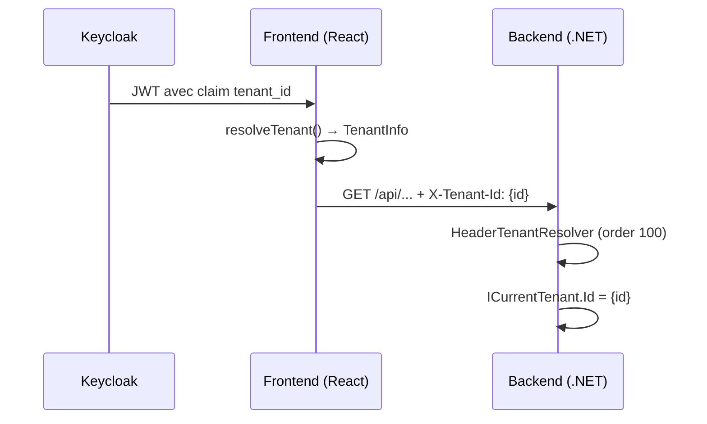

# @granit/multi-tenancy

Types et pipeline de résolution tenant — miroir TypeScript du contrat `Granit.MultiTenancy` .NET.

## Pourquoi

- Abstraction partagée pour le multi-tenancy front-end
- Pipeline de résolution extensible (même pattern que le backend .NET)
- Resolver JWT intégré pour Keycloak (`tenant_id` claim)
- Pur TypeScript — aucune dépendance React ou runtime

## Architecture

Le backend .NET résout le tenant via un middleware HTTP (header `X-Tenant-Id`
ou claim JWT `tenant_id`). Le front-end est la **source** du tenant : il lit
le claim depuis le token Keycloak et l'envoie via l'en-tête HTTP.



## API

### Types

#### `TenantInfo`

Information sur un tenant.

| Champ  | Type                             | Description                         |
| ------ | -------------------------------- | ----------------------------------- |
| `id`   | `string` (readonly)              | Identifiant unique du tenant (GUID) |
| `name` | `string \| undefined` (readonly) | Nom d'affichage du tenant           |

#### `CurrentTenant`

État courant du tenant dans le contexte React.

| Champ         | Type                             | Description                   |
| ------------- | -------------------------------- | ----------------------------- |
| `isAvailable` | `boolean` (readonly)             | `true` si un tenant est actif |
| `tenantId`    | `string \| undefined` (readonly) | ID du tenant courant          |
| `tenantName`  | `string \| undefined` (readonly) | Nom du tenant courant         |

#### `MultiTenancyOptions`

| Option               | Type      | Défaut          | Description                    |
| -------------------- | --------- | --------------- | ------------------------------ |
| `isEnabled`          | `boolean` | `true`          | Active/désactive la résolution |
| `tenantIdClaimType`  | `string`  | `"tenant_id"`   | Nom du claim JWT               |
| `tenantIdHeaderName` | `string`  | `"X-Tenant-Id"` | Nom du header HTTP             |

### `TenantResolver` (interface)

Contract d'un resolver de tenant. Miroir de `ITenantResolver` .NET.

| Propriété   | Type                       | Description                               |
| ----------- | -------------------------- | ----------------------------------------- |
| `order`     | `number` (readonly)        | Priorité — plus petit = résolu en premier |
| `name`      | `string` (readonly)        | Nom pour le debug                         |
| `resolve()` | `() => TenantInfo \| null` | Tente de résoudre le tenant               |

### `resolveTenant(resolvers): TenantInfo | null`

Exécute les resolvers triés par `order` croissant. Retourne le premier résultat
non-null (stratégie **first-wins**, identique au pipeline .NET).

```typescript
import { resolveTenant } from '@granit/multi-tenancy';

import type { TenantResolver } from '@granit/multi-tenancy';

const resolvers: TenantResolver[] = [
  { order: 100, name: 'url', resolve: () => extractFromUrl() },
  { order: 200, name: 'jwt', resolve: () => extractFromJwt() },
];

const tenant = resolveTenant(resolvers);
// → premier resolver qui retourne non-null
```

### `createJwtClaimTenantResolver(options): TenantResolver`

Factory pour un resolver qui extrait le tenant depuis un JWT décodé.
Miroir de `JwtClaimTenantResolver` .NET (order = 200).

```typescript
import { createJwtClaimTenantResolver } from '@granit/multi-tenancy';

const resolver = createJwtClaimTenantResolver({
  tokenParsedGetter: () => keycloak.tokenParsed,
  claimType: 'tenant_id', // optionnel, défaut
});

resolver.resolve();
// → { id: "abc-123", name: "Acme Corp" } ou null
```

#### Options

| Option              | Type                                         | Défaut        | Description                        |
| ------------------- | -------------------------------------------- | ------------- | ---------------------------------- |
| `tokenParsedGetter` | `() => Record<string, unknown> \| undefined` | —             | Getter vers le payload JWT décodé  |
| `claimType`         | `string`                                     | `"tenant_id"` | Nom du claim contenant l'ID tenant |

Le resolver extrait aussi `tenant_name` s'il est présent dans le token.

## Resolver personnalisé

Pour un resolver basé sur un sous-domaine (SaaS) :

```typescript
import type { TenantResolver } from '@granit/multi-tenancy';

const subdomainResolver: TenantResolver = {
  order: 100, // priorité supérieure au JWT
  name: 'SubdomainTenantResolver',
  resolve() {
    const match = window.location.hostname.match(/^([^.]+)\.app\.example\.com$/);
    if (!match) return null;
    return { id: match[1] };
  },
};
```

## Correspondance .NET

| .NET                                                   | TypeScript                          |
| ------------------------------------------------------ | ----------------------------------- |
| `Granit.MultiTenancy.ITenantInfo`                      | `TenantInfo`                        |
| `Granit.Core.MultiTenancy.ICurrentTenant`              | `CurrentTenant`                     |
| `Granit.MultiTenancy.Options.MultiTenancyOptions`      | `MultiTenancyOptions`               |
| `Granit.MultiTenancy.Resolvers.ITenantResolver`        | `TenantResolver`                    |
| `Granit.MultiTenancy.Pipeline.TenantResolverPipeline`  | `resolveTenant()`                   |
| `Granit.MultiTenancy.Resolvers.JwtClaimTenantResolver` | `createJwtClaimTenantResolver()`    |
| `Granit.MultiTenancy.Resolvers.HeaderTenantResolver`   | N/A (géré par `@granit/api-client`) |

## Types exportés

| Export                          | Type        | Description              |
| ------------------------------- | ----------- | ------------------------ |
| `TenantInfo`                    | `interface` | Information tenant       |
| `CurrentTenant`                 | `interface` | État courant du tenant   |
| `MultiTenancyOptions`           | `interface` | Options de configuration |
| `DEFAULT_MULTI_TENANCY_OPTIONS` | `const`     | Valeurs par défaut       |
| `TenantResolver`                | `interface` | Contract de resolver     |
| `resolveTenant`                 | `function`  | Pipeline first-wins      |
| `JwtClaimTenantResolverOptions` | `interface` | Options du resolver JWT  |
| `createJwtClaimTenantResolver`  | `function`  | Factory resolver JWT     |

## Peer dependencies

Aucune — package pur TypeScript sans dépendance runtime.
