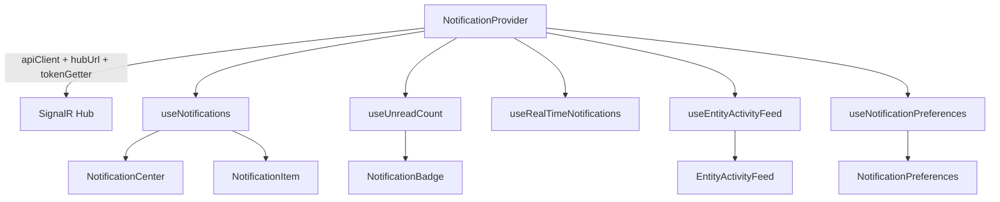

# @granit/notifications

Centre de notifications temps-réel avec SignalR, boîte de réception paginée, badge non-lus, fil d'activité par entité et préférences utilisateur. Consomme l'API REST `Granit.Notifications.Endpoints` (.NET).

## Pourquoi

- Notifications push en temps-réel via SignalR (`@microsoft/signalr`)
- Boîte de réception paginée avec marquage lu / tout lu
- Badge non-lus synchronisé (SignalR + polling de repli)
- Fil d'activité par entité (style Odoo)
- Matrice de préférences type × canal avec mise à jour optimiste et rollback
- Composants headless (HTML sémantique + `data-*` pour le styling applicatif)

## Architecture



Le `NotificationProvider` :
1. Injecte la configuration (instance Axios + basePath) dans tous les hooks enfants via un contexte React
2. Établit une connexion SignalR vers le hub (`/hubs/notifications`) avec reconnexion automatique
3. Écoute l'événement `ReceiveNotification` et met à jour le compteur non-lus en temps-réel

## Configuration

### `NotificationProvider`

Wrappez les composants qui utilisent les hooks notifications dans un `NotificationProvider` :

```tsx
import { NotificationProvider } from '@granit/notifications';

function App() {
  return (
    <NotificationProvider
      apiClient={apiClient}
      basePath="/api"
      hubUrl="/hubs/notifications"
      tokenGetter={async () => keycloak.token ?? null}
    >
      <Dashboard />
    </NotificationProvider>
  );
}
```

| Prop | Type | Défaut | Description |
| --- | --- | --- | --- |
| `apiClient` | `AxiosInstance` | — | Instance Axios configurée (via `@granit/api-client`) |
| `basePath` | `string` | `'/api'` | Préfixe des endpoints REST |
| `hubUrl` | `string` | `'/hubs/notifications'` | URL du hub SignalR |
| `tokenGetter` | `() => Promise<string \| null>` | — | Fournit le JWT pour l'authentification SignalR |

## Hooks

### `useNotifications(options?): UseNotificationsResult`

Boîte de réception paginée avec support de chargement progressif.

```tsx
const {
  notifications,  // NotificationDto[]
  totalCount,     // nombre total
  loading,        // true au chargement initial
  loadingMore,    // true pendant le chargement de la page suivante
  error,          // Error | null
  hasMore,        // true s'il reste des pages à charger
  loadMore,       // charge la page suivante
  refresh,        // recharge depuis le début
  markRead,       // marque une notification comme lue
  markAllRead,    // marque toutes les notifications comme lues
} = useNotifications({ pageSize: 20 });
```

#### Options

| Option | Type | Défaut | Description |
| --- | --- | --- | --- |
| `pageSize` | `number` | `20` | Nombre de notifications par page |

### `useUnreadCount(options?): UseUnreadCountResult`

Compteur non-lus synchronisé par SignalR et polling de repli.

```tsx
const { count, refresh } = useUnreadCount({ pollingInterval: 60_000 });
```

#### Options

| Option | Type | Défaut | Description |
| --- | --- | --- | --- |
| `pollingInterval` | `number` | `60000` | Intervalle de polling en ms (0 pour désactiver) |

#### Résultat

| Propriété | Type | Description |
| --- | --- | --- |
| `count` | `number` | Nombre de notifications non lues |
| `refresh` | `() => void` | Force un rechargement immédiat |

### `useRealTimeNotifications(): UseRealTimeNotificationsResult`

Expose la dernière notification reçue en temps-réel et l'état de la connexion SignalR. Utile pour déclencher des toasts ou alertes in-app.

```tsx
const { lastNotification, connectionState } = useRealTimeNotifications();

useEffect(() => {
  if (lastNotification) {
    toast.info(lastNotification.title);
  }
}, [lastNotification]);
```

#### Résultat

| Propriété | Type | Description |
| --- | --- | --- |
| `lastNotification` | `NotificationDto \| null` | Dernière notification reçue via SignalR |
| `connectionState` | `ConnectionState` | `'disconnected'` \| `'connecting'` \| `'connected'` \| `'reconnecting'` |

### `useEntityActivityFeed(options): UseEntityActivityFeedResult`

Fil d'activité paginé lié à une entité (style Odoo).

```tsx
const {
  entries,      // ActivityFeedEntryDto[]
  totalCount,   // nombre total d'entrées
  loading,      // true au chargement initial
  loadingMore,  // true pendant le chargement de la page suivante
  error,        // Error | null
  hasMore,      // true s'il reste des pages à charger
  loadMore,     // charge la page suivante
  refresh,      // recharge depuis le début
} = useEntityActivityFeed({
  entityType: 'Patient',
  entityId: 'p-1',
  pageSize: 20,
});
```

#### Options

| Option | Type | Défaut | Description |
| --- | --- | --- | --- |
| `entityType` | `string` | — | Type de l'entité (ex : `'Patient'`) |
| `entityId` | `string` | — | Identifiant de l'entité |
| `pageSize` | `number` | `20` | Nombre d'entrées par page |

### `useNotificationPreferences(): UseNotificationPreferencesResult`

Hook CRUD pour les préférences de notification (matrice type × canal) avec mise à jour optimiste et rollback en cas d'erreur.

```tsx
const { preferences, loading, saving, error, toggleChannel, refresh } =
  useNotificationPreferences();

await toggleChannel('AppointmentReminder', 'email', false);
```

#### Résultat

| Propriété | Type | Description |
| --- | --- | --- |
| `preferences` | `NotificationPreferenceDto[]` | Liste des préférences |
| `loading` | `boolean` | `true` pendant le chargement initial |
| `saving` | `boolean` | `true` pendant la sauvegarde |
| `error` | `Error \| null` | Dernière erreur |
| `toggleChannel` | `(type, channel, enabled) => Promise<void>` | Active/désactive un canal pour un type |
| `refresh` | `() => void` | Recharge les préférences |

## Composants

Tous les composants sont **headless** : HTML sémantique, attributs `data-*` pour le styling, aucun CSS intégré.

### `<NotificationBadge />`

Badge affichant le nombre de notifications non lues. Ne rend rien quand le compteur est à 0.

```tsx
<NotificationBadge count={unreadCount} max={99} />
```

| Prop | Type | Défaut | Description |
| --- | --- | --- | --- |
| `count` | `number` | — | Nombre de notifications non lues |
| `max` | `number` | `99` | Valeur maximale affichée (au-delà : `99+`) |
| `className` | `string` | — | Classe CSS optionnelle |

#### Attributs `data-*`

| Attribut | Valeur | Description |
| --- | --- | --- |
| `data-count` | nombre réel | Compteur réel (même si l'affichage est capé) |

### `<NotificationItem />`

Ligne de notification individuelle — titre, sévérité, date, état de lecture. Accessible au clavier.

```tsx
<NotificationItem
  notification={notification}
  onClick={(n) => navigateTo(n.entityType, n.entityId)}
/>
```

| Prop | Type | Description |
| --- | --- | --- |
| `notification` | `NotificationDto` | La notification à afficher |
| `onClick` | `(notification) => void` | Callback au clic / Enter / Espace |
| `className` | `string` | Classe CSS optionnelle |

#### Attributs `data-*`

| Attribut | Valeur | Description |
| --- | --- | --- |
| `data-severity` | `info` \| `success` \| `warning` \| `error` | Sévérité de la notification |
| `data-read` | `true` \| `false` | État de lecture |

### `<NotificationCenter />`

Bouton cloche + dropdown inbox. Gère l'ouverture/fermeture, le marquage global et le chargement progressif.

```tsx
<NotificationCenter
  notifications={notifications}
  unreadCount={count}
  loading={loading}
  hasMore={hasMore}
  onLoadMore={loadMore}
  onNotificationClick={(n) => markRead(n.id)}
  onMarkAllRead={markAllRead}
/>
```

| Prop | Type | Défaut | Description |
| --- | --- | --- | --- |
| `notifications` | `NotificationDto[]` | — | Liste des notifications |
| `unreadCount` | `number` | — | Compteur non-lus (pour le badge) |
| `loading` | `boolean` | — | Affiche un indicateur de chargement |
| `hasMore` | `boolean` | — | Affiche le bouton « Charger plus » |
| `onLoadMore` | `() => void` | — | Callback pour charger la page suivante |
| `onNotificationClick` | `(notification) => void` | — | Callback au clic sur une notification |
| `onMarkAllRead` | `() => void` | — | Callback pour marquer tout comme lu |
| `renderItem` | `(notification) => ReactNode` | — | Rendu personnalisé par notification |
| `emptyMessage` | `string` | `'Aucune notification'` | Message si la boîte est vide |
| `className` | `string` | — | Classe CSS optionnelle |

### `<EntityActivityFeed />`

Fil d'activité lié à une entité avec pagination.

```tsx
<EntityActivityFeed
  entries={entries}
  loading={loading}
  loadingMore={loadingMore}
  hasMore={hasMore}
  onLoadMore={loadMore}
/>
```

| Prop | Type | Défaut | Description |
| --- | --- | --- | --- |
| `entries` | `ActivityFeedEntryDto[]` | — | Liste des entrées |
| `loading` | `boolean` | — | Affiche un indicateur de chargement |
| `loadingMore` | `boolean` | — | Désactive le bouton « Charger plus » |
| `hasMore` | `boolean` | — | Affiche le bouton « Charger plus » |
| `onLoadMore` | `() => void` | — | Callback pour charger la page suivante |
| `renderEntry` | `(entry) => ReactNode` | — | Rendu personnalisé par entrée |
| `emptyMessage` | `string` | `'Aucune activité'` | Message si le fil est vide |
| `className` | `string` | — | Classe CSS optionnelle |

### `<NotificationPreferences />`

Matrice type × canal avec des checkboxes. Désactive les toggles pendant la sauvegarde.

```tsx
<NotificationPreferences
  preferences={preferences}
  loading={loading}
  saving={saving}
  onToggle={toggleChannel}
/>
```

| Prop | Type | Description |
| --- | --- | --- |
| `preferences` | `NotificationPreferenceDto[]` | Liste des préférences |
| `loading` | `boolean` | Affiche un indicateur de chargement |
| `saving` | `boolean` | Désactive les checkboxes pendant la sauvegarde |
| `onToggle` | `(type, channel, enabled) => void` | Callback lors du changement d'un toggle |
| `className` | `string` | Classe CSS optionnelle |

## Types

### `NotificationSeverity`

```typescript
type NotificationSeverity = 'info' | 'success' | 'warning' | 'error';
```

### `NotificationDto`

```typescript
interface NotificationDto {
  id: string;
  title: string;
  body: string | null;
  severity: NotificationSeverity;
  entityType: string | null;
  entityId: string | null;
  isRead: boolean;
  createdAt: string;            // ISO 8601
  readAt: string | null;
}
```

### `NotificationPageDto`

```typescript
interface NotificationPageDto {
  items: NotificationDto[];
  totalCount: number;
  unreadCount: number;
}
```

### `ActivityFeedEntryDto`

```typescript
interface ActivityFeedEntryDto {
  id: string;
  title: string;
  body: string | null;
  severity: NotificationSeverity;
  createdAt: string;            // ISO 8601
  userId: string | null;
  userDisplayName: string | null;
}
```

### `ActivityFeedPageDto`

```typescript
interface ActivityFeedPageDto {
  items: ActivityFeedEntryDto[];
  totalCount: number;
}
```

### `NotificationChannel`

```typescript
type NotificationChannel = 'inApp' | 'email' | 'push';
```

### `NotificationPreferenceDto`

```typescript
interface NotificationPreferenceDto {
  notificationType: string;
  label: string;
  channels: Record<NotificationChannel, boolean>;
}
```

### `ConnectionState`

```typescript
type ConnectionState = 'disconnected' | 'connecting' | 'connected' | 'reconnecting';
```

### `NotificationConfig`

```typescript
interface NotificationConfig {
  apiClient: AxiosInstance;
  basePath?: string;            // défaut: '/api'
  hubUrl?: string;              // défaut: '/hubs/notifications'
  tokenGetter?: () => Promise<string | null>;
}
```

## API REST consommée

| Méthode | Endpoint | Description |
| --- | --- | --- |
| `GET` | `/notifications?skip=0&take=20` | Boîte de réception paginée |
| `PATCH` | `/notifications/{id}/read` | Marquer une notification comme lue |
| `POST` | `/notifications/read-all` | Marquer toutes les notifications comme lues |
| `GET` | `/notifications/unread-count` | Nombre de notifications non lues |
| `GET` | `/activity-feed/{entityType}/{entityId}?skip=0&take=20` | Fil d'activité par entité |
| `GET` | `/notification-preferences` | Liste des préférences |
| `PUT` | `/notification-preferences/{notificationType}` | Mettre à jour une préférence |

Tous les chemins sont relatifs au `basePath` configuré (défaut : `/api`).

### Hub SignalR

| URL | Événement | Direction | Payload |
| --- | --- | --- | --- |
| `/hubs/notifications` | `ReceiveNotification` | Serveur → Client | `NotificationDto` |

Transport : WebSockets (prioritaire) avec fallback LongPolling. Reconnexion automatique intégrée.

## Exemple complet

```tsx
import {
  NotificationProvider,
  useNotifications,
  useUnreadCount,
  useRealTimeNotifications,
  useNotificationPreferences,
  NotificationCenter,
  NotificationPreferences,
} from '@granit/notifications';

function NotificationBell() {
  const { notifications, loading, hasMore, loadMore, markRead, markAllRead } =
    useNotifications();
  const { count } = useUnreadCount();
  const { lastNotification } = useRealTimeNotifications();

  // Toast sur nouvelle notification
  useEffect(() => {
    if (lastNotification) {
      toast.info(lastNotification.title);
    }
  }, [lastNotification]);

  return (
    <NotificationCenter
      notifications={notifications}
      unreadCount={count}
      loading={loading}
      hasMore={hasMore}
      onLoadMore={loadMore}
      onNotificationClick={(n) => markRead(n.id)}
      onMarkAllRead={markAllRead}
    />
  );
}

function SettingsPage() {
  const { preferences, loading, saving, toggleChannel } =
    useNotificationPreferences();

  return (
    <NotificationPreferences
      preferences={preferences}
      loading={loading}
      saving={saving}
      onToggle={toggleChannel}
    />
  );
}

function App() {
  return (
    <NotificationProvider
      apiClient={apiClient}
      basePath="/api"
      tokenGetter={async () => keycloak.token ?? null}
    >
      <header>
        <NotificationBell />
      </header>
      <main>
        <SettingsPage />
      </main>
    </NotificationProvider>
  );
}
```

## Peer dependencies

- `@microsoft/signalr` >=8.0.0 — Connexion temps-réel
- `axios` — Instance Axios pour les appels REST
- `react` ^19.0.0
