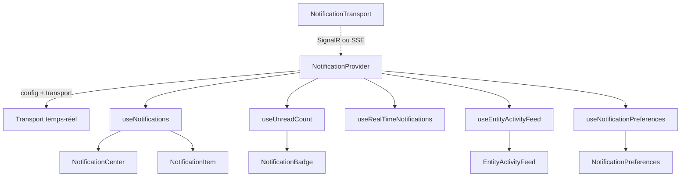

# @granit/notifications

Centre de notifications transport-agnostique : boîte de réception paginée, badge non-lus, fil d'activité par entité, préférences utilisateur et abstraction transport temps-réel. Consomme l'API REST `Granit.Notifications.Endpoints` (.NET).

Le transport temps-réel (SignalR, SSE) est injecté via l'interface `NotificationTransport`. Les apps choisissent le package transport adapté :

| Package                         | Transport                         |
| ------------------------------- | --------------------------------- |
| `@granit/notifications-signalr` | SignalR (WebSocket + LongPolling) |
| `@granit/notifications-sse`     | Server-Sent Events                |

Les canaux de livraison (Web Push, Mobile Push) sont gérés par des packages séparés :

| Package                             | Rôle                                        |
| ----------------------------------- | ------------------------------------------- |
| `@granit/notifications-web-push`    | Abonnement VAPID + Service Worker           |
| `@granit/notifications-mobile-push` | Enregistrement token FCM/APNs via Capacitor |

## Pourquoi

- Transport temps-réel abstrait — l'app choisit SignalR ou SSE sans changer les hooks
- Boîte de réception paginée avec marquage lu / tout lu
- Badge non-lus synchronisé (transport push + polling de repli)
- Fil d'activité par entité
- Matrice de préférences type × canal dynamique (canaux extensibles, pas de liste fixe)
- Composants headless (HTML sémantique + `data-*` pour le styling applicatif)

## Architecture



Le `NotificationProvider` :

1. Injecte la configuration (instance Axios + basePath) dans tous les hooks enfants via un contexte React
2. Si un `transport` est fourni, établit la connexion temps-réel et écoute les notifications entrantes
3. Sans transport, fonctionne en mode REST-only (polling via `useUnreadCount`)

## Configuration

### `NotificationProvider`

Wrappez les composants qui utilisent les hooks notifications dans un `NotificationProvider` :

```tsx
import { NotificationProvider } from '@granit/notifications';
import { createSignalRTransport } from '@granit/notifications-signalr';

const transport = createSignalRTransport({
  hubUrl: '/hubs/notifications',
  tokenGetter: async () => keycloak.token ?? null,
});

function App() {
  return (
    <NotificationProvider config={{ apiClient, basePath: '/api' }} transport={transport}>
      <Dashboard />
    </NotificationProvider>
  );
}
```

#### Props

| Prop        | Type                    | Défaut | Description                          |
| ----------- | ----------------------- | ------ | ------------------------------------ |
| `config`    | `NotificationConfig`    | —      | Configuration (apiClient + basePath) |
| `transport` | `NotificationTransport` | —      | Transport temps-réel (optionnel)     |

#### `NotificationConfig`

| Propriété   | Type            | Défaut   | Description                                          |
| ----------- | --------------- | -------- | ---------------------------------------------------- |
| `apiClient` | `AxiosInstance` | —        | Instance Axios configurée (via `@granit/api-client`) |
| `basePath`  | `string`        | `'/api'` | Préfixe des endpoints REST                           |

### `NotificationTransport`

Interface implémentée par les packages transport (`@granit/notifications-signalr`, `@granit/notifications-sse`).

```typescript
interface NotificationTransport {
  connect(): Promise<void>;
  disconnect(): Promise<void>;
  readonly state: ConnectionState;
  onNotification(callback: (notification: NotificationDto) => void): () => void;
  onStateChange(callback: (state: ConnectionState) => void): () => void;
}
```

## Canaux de notification

Les canaux sont extensibles — pas de liste TypeScript fixe. Le type `NotificationChannel` est `string & {}` et les constantes bien connues sont fournies :

```typescript
import { NotificationChannels } from '@granit/notifications';

// NotificationChannels.InApp    → 'inApp'
// NotificationChannels.Email    → 'email'
// NotificationChannels.Sms      → 'sms'
// NotificationChannels.WhatsApp → 'whatsApp'
// NotificationChannels.Push     → 'push'
// NotificationChannels.MobilePush → 'mobilePush'
// NotificationChannels.Sse      → 'sse'
// NotificationChannels.SignalR   → 'signalR'
// NotificationChannels.Zulip    → 'zulip'
```

Pour extraire dynamiquement les canaux disponibles depuis les préférences API :

```typescript
import { getAvailableChannels } from '@granit/notifications';

const channels = getAvailableChannels(preferences);
// → ['inApp', 'email', 'sms', 'whatsApp'] (selon le backend)
```

## Hooks

### `useNotifications(options?): UseNotificationsResult`

Boîte de réception paginée avec support de chargement progressif.

```tsx
const {
  notifications, // NotificationDto[]
  totalCount, // nombre total
  loading, // true au chargement initial
  loadingMore, // true pendant le chargement de la page suivante
  error, // Error | null
  hasMore, // true s'il reste des pages à charger
  loadMore, // charge la page suivante
  refresh, // recharge depuis le début
  markRead, // marque une notification comme lue
  markAllRead, // marque toutes les notifications comme lues
} = useNotifications({ pageSize: 20 });
```

#### Options

| Option     | Type     | Défaut | Description                      |
| ---------- | -------- | ------ | -------------------------------- |
| `pageSize` | `number` | `20`   | Nombre de notifications par page |

### `useUnreadCount(options?): UseUnreadCountResult`

Compteur non-lus synchronisé par transport temps-réel et polling de repli.

```tsx
const { count, refresh } = useUnreadCount({ pollingInterval: 60_000 });
```

#### Options

| Option            | Type     | Défaut  | Description                                     |
| ----------------- | -------- | ------- | ----------------------------------------------- |
| `pollingInterval` | `number` | `60000` | Intervalle de polling en ms (0 pour désactiver) |

#### Résultat

| Propriété | Type         | Description                      |
| --------- | ------------ | -------------------------------- |
| `count`   | `number`     | Nombre de notifications non lues |
| `refresh` | `() => void` | Force un rechargement immédiat   |

### `useRealTimeNotifications(): UseRealTimeNotificationsResult`

Expose la dernière notification reçue en temps-réel et l'état de la connexion. Utile pour déclencher des toasts ou alertes in-app.

```tsx
const { lastNotification, connectionState } = useRealTimeNotifications();

useEffect(() => {
  if (lastNotification) {
    toast.info(lastNotification.title);
  }
}, [lastNotification]);
```

#### Résultat

| Propriété          | Type                      | Description                                                             |
| ------------------ | ------------------------- | ----------------------------------------------------------------------- |
| `lastNotification` | `NotificationDto \| null` | Dernière notification reçue via le transport                            |
| `connectionState`  | `ConnectionState`         | `'disconnected'` \| `'connecting'` \| `'connected'` \| `'reconnecting'` |

### `useEntityActivityFeed(options): UseEntityActivityFeedResult`

Fil d'activité paginé lié à une entité.

```tsx
const {
  entries, // ActivityFeedEntryDto[]
  totalCount, // nombre total d'entrées
  loading, // true au chargement initial
  loadingMore, // true pendant le chargement de la page suivante
  error, // Error | null
  hasMore, // true s'il reste des pages à charger
  loadMore, // charge la page suivante
  refresh, // recharge depuis le début
} = useEntityActivityFeed({
  entityType: 'Patient',
  entityId: 'p-1',
  pageSize: 20,
});
```

#### Options

| Option       | Type     | Défaut | Description                         |
| ------------ | -------- | ------ | ----------------------------------- |
| `entityType` | `string` | —      | Type de l'entité (ex : `'Patient'`) |
| `entityId`   | `string` | —      | Identifiant de l'entité             |
| `pageSize`   | `number` | `20`   | Nombre d'entrées par page           |

### `useNotificationPreferences(): UseNotificationPreferencesResult`

Hook CRUD pour les préférences de notification (matrice type × canal) avec mise à jour optimiste et rollback en cas d'erreur. Les canaux sont dynamiques — déterminés par la réponse API.

```tsx
const { preferences, loading, saving, error, toggleChannel, refresh } =
  useNotificationPreferences();

// Les canaux disponibles viennent du backend
const channels = getAvailableChannels(preferences);

await toggleChannel('AppointmentReminder', 'email', false);
```

#### Résultat

| Propriété       | Type                                        | Description                            |
| --------------- | ------------------------------------------- | -------------------------------------- |
| `preferences`   | `NotificationPreferenceDto[]`               | Liste des préférences                  |
| `loading`       | `boolean`                                   | `true` pendant le chargement initial   |
| `saving`        | `boolean`                                   | `true` pendant la sauvegarde           |
| `error`         | `Error \| null`                             | Dernière erreur                        |
| `toggleChannel` | `(type, channel, enabled) => Promise<void>` | Active/désactive un canal pour un type |
| `refresh`       | `() => void`                                | Recharge les préférences               |

## Types

### `NotificationSeverity`

```typescript
type NotificationSeverity = 'info' | 'success' | 'warning' | 'error';
```

### `NotificationDto`

```typescript
interface NotificationDto {
  id: string;
  title: string;
  body: string | null;
  severity: NotificationSeverity;
  entityType: string | null;
  entityId: string | null;
  isRead: boolean;
  createdAt: string; // ISO 8601
  readAt: string | null;
}
```

### `NotificationPageDto`

```typescript
interface NotificationPageDto {
  items: NotificationDto[];
  totalCount: number;
  unreadCount: number;
}
```

### `ActivityFeedEntryDto`

```typescript
interface ActivityFeedEntryDto {
  id: string;
  title: string;
  body: string | null;
  severity: NotificationSeverity;
  createdAt: string; // ISO 8601
  userId: string | null;
  userDisplayName: string | null;
}
```

### `ActivityFeedPageDto`

```typescript
interface ActivityFeedPageDto {
  items: ActivityFeedEntryDto[];
  totalCount: number;
}
```

### `NotificationChannel`

```typescript
// Extensible — accepte toute chaîne, pas une union fixe
type NotificationChannel = string & {};
```

### `NotificationPreferenceDto`

```typescript
interface NotificationPreferenceDto {
  notificationType: string;
  label: string;
  channels: Record<string, boolean>;
}
```

### `ConnectionState`

```typescript
type ConnectionState = 'disconnected' | 'connecting' | 'connected' | 'reconnecting';
```

### `NotificationConfig`

```typescript
interface NotificationConfig {
  apiClient: AxiosInstance;
  basePath?: string; // défaut: '/api'
}
```

## API REST consommée

| Méthode | Endpoint                                                    | Description                                 |
| ------- | ----------------------------------------------------------- | ------------------------------------------- |
| `GET`   | `/notifications?page=1&pageSize=20`                         | Boîte de réception paginée                  |
| `PATCH` | `/notifications/{id}/read`                                  | Marquer une notification comme lue          |
| `POST`  | `/notifications/read-all`                                   | Marquer toutes les notifications comme lues |
| `GET`   | `/notifications/unread-count`                               | Nombre de notifications non lues            |
| `GET`   | `/activity-feed/{entityType}/{entityId}?page=1&pageSize=20` | Fil d'activité par entité                   |
| `GET`   | `/notification-preferences`                                 | Liste des préférences                       |
| `PUT`   | `/notification-preferences/{notificationType}`              | Mettre à jour une préférence                |

Tous les chemins sont relatifs au `basePath` configuré (défaut : `/api`).

## Exemple complet

```tsx
import {
  NotificationProvider,
  useNotifications,
  useUnreadCount,
  useRealTimeNotifications,
  useNotificationPreferences,
  getAvailableChannels,
} from '@granit/notifications';
import { createSignalRTransport } from '@granit/notifications-signalr';

const transport = createSignalRTransport({
  hubUrl: '/hubs/notifications',
  tokenGetter: async () => keycloak.token ?? null,
});

function NotificationBell() {
  const { notifications, loading, hasMore, loadMore, markRead, markAllRead } = useNotifications();
  const { count } = useUnreadCount();
  const { lastNotification } = useRealTimeNotifications();

  useEffect(() => {
    if (lastNotification) {
      toast.info(lastNotification.title);
    }
  }, [lastNotification]);

  return (
    <NotificationCenter
      notifications={notifications}
      unreadCount={count}
      loading={loading}
      hasMore={hasMore}
      onLoadMore={loadMore}
      onNotificationClick={(n) => markRead(n.id)}
      onMarkAllRead={markAllRead}
    />
  );
}

function SettingsPage() {
  const { preferences, loading, saving, toggleChannel } = useNotificationPreferences();
  const channels = getAvailableChannels(preferences);

  return (
    <NotificationPreferences
      preferences={preferences}
      channels={channels}
      loading={loading}
      saving={saving}
      onToggle={toggleChannel}
    />
  );
}

function App() {
  return (
    <NotificationProvider config={{ apiClient, basePath: '/api' }} transport={transport}>
      <header>
        <NotificationBell />
      </header>
      <main>
        <SettingsPage />
      </main>
    </NotificationProvider>
  );
}
```

## Peer dependencies

- `@granit/querying` — Pagination
- `axios` — Instance Axios pour les appels REST
- `react` ^19.0.0

## Voir aussi

- [notifications-signalr.md](notifications-signalr.md) — Transport SignalR
- [notifications-sse.md](notifications-sse.md) — Transport SSE
- [notifications-web-push.md](notifications-web-push.md) — Abonnement Web Push
- [notifications-mobile-push.md](notifications-mobile-push.md) — Enregistrement Mobile Push
