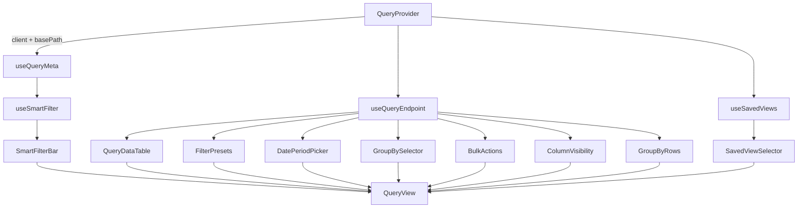

# @granit/querying

Grille de données Odoo-like : recherche, filtres, tri, pagination, group-by, vues sauvegardées. Consomme l'API REST `Granit.Querying` (.NET).

## Pourquoi

- Recherche plein texte, filtres par champ/opérateur, presets, quick filters, tri multi-colonnes
- SmartFilterBar omnibox (style Odoo) avec suggestions et tokens
- Group-by avec expand/collapse et lazy loading
- Vues sauvegardées (personnelles/partagées) avec CRUD complet
- Composants headless intégrés à `@granit/ui` (Table, Button, Badge, DropdownMenu…)
- Sérialisation/désérialisation d'URL pour bookmarkable queries

## Architecture



Le `QueryProvider` :

1. Injecte la configuration (instance Axios + basePath) dans tous les hooks enfants via un contexte React
2. Fournit une factory de query keys pour TanStack Query (`buildQueryKey`)

## Configuration

### `QueryProvider`

Wrappez les composants qui utilisent les hooks querying dans un `QueryProvider` :

```tsx
import { QueryProvider } from '@granit/querying';

function App() {
  return (
    <QueryProvider config={{ client: apiClient, basePath: '/api/v1/patients' }}>
      <PatientList />
    </QueryProvider>
  );
}
```

| Prop                    | Type            | Défaut               | Description                                            |
| ----------------------- | --------------- | -------------------- | ------------------------------------------------------ |
| `config.client`         | `AxiosInstance` | —                    | Instance Axios configurée (via `@granit/api-client`)   |
| `config.basePath`       | `string`        | —                    | Préfixe des endpoints REST (ex : `'/api/v1/patients'`) |
| `config.queryKeyPrefix` | `string[]`      | segments de basePath | Préfixe personnalisé pour les query keys TanStack      |

## Hooks

### `useQueryMeta(): UseQueryResult<QueryMetadata>`

Charge et cache les métadonnées (colonnes, champs filtrables, presets, etc.) depuis `GET {basePath}/meta`. Considère les métadonnées comme statiques (`staleTime: Infinity`).

```tsx
const { data: meta, isLoading } = useQueryMeta();

if (meta) {
  console.log(meta.columns); // ColumnDefinition[]
  console.log(meta.filterableFields); // FilterableField[]
  console.log(meta.presetFilterGroups); // FilterGroupMeta[]
}
```

### `useQueryEndpoint<T>(options?): UseQueryEndpointReturn<T>`

Hook principal de requêtage. Gère l'état via `useReducer` (14 actions) et fetch via TanStack Query avec `keepPreviousData` pour des transitions fluides.

```tsx
const {
  params, // QueryParams courant
  query, // UseQueryResult<PagedResult<T>> (mode flat)
  groupedQuery, // UseQueryResult<GroupedResult<T>> (mode grouped)
  isGrouped, // true si groupBy est défini

  // Dispatchers
  setPage,
  setPageSize,
  setSearch,
  setFilters,
  addFilter,
  removeFilter,
  setSort,
  toggleSort,
  setPresets,
  setQuickFilters,
  toggleQuickFilter,
  setGroupBy,
  setParams,
  reset,
} = useQueryEndpoint<Patient>();

// Exemple: afficher les résultats
if (query.isLoading) return <Spinner />;
const { items, totalCount } = query.data!;
```

#### Options

| Option          | Type          | Défaut                      | Description                    |
| --------------- | ------------- | --------------------------- | ------------------------------ |
| `initialParams` | `QueryParams` | `{ page: 1, pageSize: 20 }` | Paramètres de requête initiaux |
| `enabled`       | `boolean`     | `true`                      | Active/désactive la requête    |

#### Dispatchers

| Méthode             | Signature                                    | Effet                                               |
| ------------------- | -------------------------------------------- | --------------------------------------------------- |
| `setPage`           | `(page: number) => void`                     | Change la page courante                             |
| `setPageSize`       | `(pageSize: number) => void`                 | Change la taille de page (reset page à 1)           |
| `setSearch`         | `(search: string) => void`                   | Définit la recherche plein texte (reset page à 1)   |
| `setFilters`        | `(filters: FilterEntry[]) => void`           | Remplace tous les filtres (reset page à 1)          |
| `addFilter`         | `(filter: FilterEntry) => void`              | Ajoute/remplace un filtre (même field+operator)     |
| `removeFilter`      | `(field: string, operator?: string) => void` | Retire un filtre par champ (et opérateur optionnel) |
| `setSort`           | `(sort: SortEntry[]) => void`                | Remplace le tri                                     |
| `toggleSort`        | `(field: string) => void`                    | Cycle : aucun → asc → desc → aucun                  |
| `setPresets`        | `(group: string, names: string[]) => void`   | Définit les presets actifs d'un groupe              |
| `setQuickFilters`   | `(names: string[]) => void`                  | Remplace les quick filters actifs                   |
| `toggleQuickFilter` | `(name: string) => void`                     | Active/désactive un quick filter                    |
| `setGroupBy`        | `(field?: string) => void`                   | Active/désactive le mode groupé                     |
| `setParams`         | `(params: QueryParams) => void`              | Remplace tous les paramètres                        |
| `reset`             | `() => void`                                 | Revient aux paramètres initiaux                     |

### `useSavedViews(): UseSavedViewsReturn`

CRUD complet pour les vues sauvegardées avec invalidation du cache TanStack Query.

```tsx
const { views, create, update, remove, setDefault } = useSavedViews();

// Lister
const savedViews = views.data; // SavedViewSummary[]

// Créer
create.mutate({ name: 'Ma vue', isShared: false, isDefault: false });

// Mettre à jour
update.mutate({ id: 'view-1', request: { name: 'Renommée', isShared: true } });

// Supprimer
remove.mutate('view-1');

// Définir comme défaut
setDefault.mutate('view-1');
```

#### Résultat

| Propriété    | Type                                 | Description                             |
| ------------ | ------------------------------------ | --------------------------------------- |
| `views`      | `UseQueryResult<SavedViewSummary[]>` | Liste des vues sauvegardées             |
| `create`     | `UseMutationResult`                  | Mutation de création                    |
| `update`     | `UseMutationResult`                  | Mutation de mise à jour                 |
| `remove`     | `UseMutationResult`                  | Mutation de suppression                 |
| `setDefault` | `UseMutationResult`                  | Mutation pour définir la vue par défaut |

### `useSmartFilter(options?): UseSmartFilterReturn`

Machine à états pour la SmartFilterBar. Gère le flux de saisie (champ → opérateur → valeur), le cycle de vie des tokens et la génération de suggestions.

```tsx
const {
  phase, // 'idle' | 'selectField' | 'selectOperator' | 'enterValue'
  inputValue, // Valeur courante de l'input
  tokens, // FilterToken[] — tokens actifs (affichés comme badges)
  suggestions, // FilterSuggestion[] — suggestions contextuelles

  // Valeurs extraites des tokens (prêtes pour useQueryEndpoint)
  filters, // FilterEntry[]
  search, // string | undefined
  presets, // Record<string, string[]>
  quickFilters, // string[]

  // Actions
  setInput,
  selectField,
  selectOperator,
  confirmValue,
  addPresetToken,
  addQuickFilterToken,
  addSearchToken,
  removeToken,
  clearAll,
  cancel,
} = useSmartFilter({ metadata: meta });
```

#### Options

| Option     | Type            | Défaut      | Description                              |
| ---------- | --------------- | ----------- | ---------------------------------------- |
| `metadata` | `QueryMetadata` | `undefined` | Métadonnées pour générer les suggestions |

#### Phases

| Phase            | Description                        | Suggestions affichées                       |
| ---------------- | ---------------------------------- | ------------------------------------------- |
| `idle`           | En attente de saisie               | Champs filtrables + presets + quick filters |
| `selectField`    | Champ sélectionné                  | Opérateurs disponibles pour le champ        |
| `selectOperator` | Opérateur sélectionné              | Saisie libre de la valeur                   |
| `enterValue`     | Valeur confirmée → retour à `idle` | —                                           |

## Composants

### `<SmartFilterBar />`

Barre de filtres omnibox avec suggestions cmdk. Affiche les tokens actifs comme badges et fournit un input avec dropdown de suggestions.

```tsx
<SmartFilterBar smartFilter={smartFilter} placeholder="Rechercher ou filtrer…" />
```

| Prop          | Type                   | Défaut                | Description                               |
| ------------- | ---------------------- | --------------------- | ----------------------------------------- |
| `smartFilter` | `UseSmartFilterReturn` | —                     | Instance retournée par `useSmartFilter()` |
| `placeholder` | `string`               | `'Search or filter…'` | Placeholder de l'input                    |
| `className`   | `string`               | —                     | Classe CSS optionnelle                    |

#### Attributs `data-*`

| Attribut                       | Élément   | Description           |
| ------------------------------ | --------- | --------------------- |
| `data-slot="smart-filter-bar"` | Container | Conteneur principal   |
| `data-slot="facet-badge"`      | Badge     | Token de filtre actif |

### `<FilterPresets />`

Groupes de presets sous forme de boutons toggle (style Odoo). Sémantique : OR au sein d'un groupe, AND entre groupes.

```tsx
<FilterPresets
  groups={meta.presetFilterGroups}
  activePresets={params.presets ?? {}}
  onToggle={setPresets}
/>
```

| Prop            | Type                       | Description                               |
| --------------- | -------------------------- | ----------------------------------------- |
| `groups`        | `FilterGroupMeta[]`        | Groupes de presets depuis les métadonnées |
| `activePresets` | `Record<string, string[]>` | Presets actifs par groupe                 |
| `onToggle`      | `(group, names) => void`   | Callback lors du toggle d'un preset       |
| `className`     | `string`                   | Classe CSS optionnelle                    |

#### Attribut `data-*`

| Attribut                     | Description         |
| ---------------------------- | ------------------- |
| `data-slot="filter-presets"` | Conteneur principal |

### `<QueryDataTable />`

Table de données propulsée par TanStack Table v8 et `@granit/ui` Table. Intègre pagination, tri et état de chargement.

```tsx
<QueryDataTable
  columns={patientColumns}
  data={query.data?.items ?? []}
  totalCount={query.data?.totalCount ?? 0}
  isLoading={query.isLoading}
  page={params.page}
  pageSize={params.pageSize}
  sort={params.sort}
  onPageChange={setPage}
  onPageSizeChange={setPageSize}
  onToggleSort={toggleSort}
/>
```

| Prop               | Type              | Défaut                | Description                                    |
| ------------------ | ----------------- | --------------------- | ---------------------------------------------- |
| `columns`          | `ColumnDef<T>[]`  | —                     | Définitions de colonnes TanStack Table         |
| `data`             | `T[]`             | —                     | Données à afficher                             |
| `totalCount`       | `number`          | —                     | Nombre total de résultats (pour la pagination) |
| `isLoading`        | `boolean`         | `false`               | Affiche des squelettes de chargement           |
| `page`             | `number`          | —                     | Page courante                                  |
| `pageSize`         | `number`          | —                     | Taille de page                                 |
| `sort`             | `SortEntry[]`     | —                     | Tri courant (pour les icônes d'en-tête)        |
| `onPageChange`     | `(page) => void`  | —                     | Callback changement de page                    |
| `onPageSizeChange` | `(size) => void`  | —                     | Callback changement de taille de page          |
| `onToggleSort`     | `(field) => void` | —                     | Callback toggle de tri                         |
| `emptyMessage`     | `string`          | `'No results found.'` | Message quand la table est vide                |
| `skeletonRows`     | `number`          | `5`                   | Nombre de lignes squelette en chargement       |
| `className`        | `string`          | —                     | Classe CSS optionnelle                         |

### `<DatePeriodPicker />`

Sélecteur de période temporelle pour filtres de dates.

```tsx
<DatePeriodPicker
  dateFilter={meta.dateFilters[0]}
  value={selectedPeriod}
  onValueChange={setSelectedPeriod}
/>
```

| Prop            | Type               | Description                  |
| --------------- | ------------------ | ---------------------------- |
| `dateFilter`    | `DateFilterMeta`   | Configuration du filtre date |
| `value`         | `DatePeriod`       | Période sélectionnée         |
| `onValueChange` | `(period) => void` | Callback au changement       |
| `className`     | `string`           | Classe CSS optionnelle       |

#### Attribut `data-*`

| Attribut                         | Description         |
| -------------------------------- | ------------------- |
| `data-slot="date-period-picker"` | Conteneur principal |

### `<GroupBySelector />`

Menu déroulant pour sélectionner un champ de regroupement.

```tsx
<GroupBySelector fields={meta.groupByFields} value={params.groupBy} onValueChange={setGroupBy} />
```

| Prop            | Type               | Défaut       | Description                           |
| --------------- | ------------------ | ------------ | ------------------------------------- |
| `fields`        | `GroupByField[]`   | —            | Champs disponibles pour le groupement |
| `value`         | `string`           | —            | Champ de groupement actif             |
| `onValueChange` | `(field?) => void` | —            | Callback au changement                |
| `label`         | `string`           | `'Group by'` | Label du bouton                       |
| `className`     | `string`           | —            | Classe CSS optionnelle                |

#### Attribut `data-*`

| Attribut                        | Description         |
| ------------------------------- | ------------------- |
| `data-slot="group-by-selector"` | Conteneur principal |

### `<SavedViewSelector />`

Menu déroulant avec liste des vues sauvegardées + dialogue de création.

```tsx
<SavedViewSelector
  savedViews={savedViews}
  selectedViewId={currentViewId}
  onSelect={(view) => applyView(view)}
/>
```

| Prop             | Type                  | Description                                      |
| ---------------- | --------------------- | ------------------------------------------------ |
| `savedViews`     | `UseSavedViewsReturn` | Instance retournée par `useSavedViews()`         |
| `selectedViewId` | `string`              | ID de la vue sélectionnée                        |
| `onSelect`       | `(view) => void`      | Callback à la sélection d'une vue                |
| `onSave`         | `() => object`        | Retourne les filtres courants pour la sauvegarde |
| `className`      | `string`              | Classe CSS optionnelle                           |

#### Attribut `data-*`

| Attribut                          | Description         |
| --------------------------------- | ------------------- |
| `data-slot="saved-view-selector"` | Conteneur principal |

### `<BulkActions />`

Barre d'actions groupées apparaissant quand des lignes sont sélectionnées.

```tsx
<BulkActions
  totalCount={100}
  selectedIds={selectedIds}
  onSelectionChange={setSelectedIds}
  visibleIds={data.map((d) => d.id)}
  actions={[
    { id: 'delete', label: 'Supprimer', variant: 'destructive', onAction: handleDelete },
    { id: 'export', label: 'Exporter', onAction: handleExport },
  ]}
/>
```

| Prop                | Type            | Description                                          |
| ------------------- | --------------- | ---------------------------------------------------- |
| `totalCount`        | `number`        | Nombre total de résultats                            |
| `selectedIds`       | `string[]`      | IDs des lignes sélectionnées                         |
| `onSelectionChange` | `(ids) => void` | Callback au changement de sélection                  |
| `visibleIds`        | `string[]`      | IDs des lignes visibles (pour « tout sélectionner ») |
| `actions`           | `BulkAction[]`  | Actions disponibles                                  |
| `className`         | `string`        | Classe CSS optionnelle                               |

#### `BulkAction`

| Propriété  | Type                                                 | Description                        |
| ---------- | ---------------------------------------------------- | ---------------------------------- |
| `id`       | `string`                                             | Identifiant unique                 |
| `label`    | `string`                                             | Texte du bouton                    |
| `icon`     | `ReactNode`                                          | Icône optionnelle                  |
| `variant`  | `'default' \| 'destructive' \| 'outline' \| 'ghost'` | Variante du bouton                 |
| `onAction` | `(ids: string[]) => void`                            | Callback avec les IDs sélectionnés |

#### Attribut `data-*`

| Attribut                   | Description                            |
| -------------------------- | -------------------------------------- |
| `data-slot="bulk-actions"` | Conteneur (absent si aucune sélection) |

### `<ColumnVisibility />`

Menu déroulant avec checkboxes pour masquer/afficher des colonnes.

```tsx
<ColumnVisibility
  columns={meta.columns}
  visibleColumns={visibleCols}
  onVisibilityChange={setVisibleCols}
/>
```

| Prop                 | Type                 | Description                     |
| -------------------- | -------------------- | ------------------------------- |
| `columns`            | `ColumnDefinition[]` | Colonnes depuis les métadonnées |
| `visibleColumns`     | `string[]`           | Noms des colonnes visibles      |
| `onVisibilityChange` | `(columns) => void`  | Callback au changement          |
| `className`          | `string`             | Classe CSS optionnelle          |

#### Attribut `data-*`

| Attribut                        | Description         |
| ------------------------------- | ------------------- |
| `data-slot="column-visibility"` | Conteneur principal |

### `<GroupByRows />`

Lignes de regroupement avec expand/collapse. Le callback `onExpand` permet le lazy loading des items.

```tsx
<GroupByRows
  groups={groupedQuery.data?.groups ?? []}
  colSpan={columns.length}
  onExpand={(group) => loadGroupItems(group)}
  renderItem={(patient, i) => <PatientRow key={i} patient={patient} />}
/>
```

| Prop         | Type                         | Description                                 |
| ------------ | ---------------------------- | ------------------------------------------- |
| `groups`     | `GroupEntry<T>[]`            | Groupes depuis `groupedQuery.data`          |
| `colSpan`    | `number`                     | Nombre de colonnes (pour le colspan)        |
| `onExpand`   | `(group) => void`            | Callback pour charger les items d'un groupe |
| `renderItem` | `(item, index) => ReactNode` | Rendu personnalisé par item                 |
| `className`  | `string`                     | Classe CSS optionnelle                      |

#### Attribut `data-*`

| Attribut                    | Description                  |
| --------------------------- | ---------------------------- |
| `data-slot="group-by-rows"` | Conteneur de ligne de groupe |

### `<QueryView />`

Composant d'assemblage complet — combine SmartFilterBar, FilterPresets, contrôles de toolbar et QueryDataTable en une vue liste Odoo-like.

```tsx
const meta = useQueryMeta();
const queryEndpoint = useQueryEndpoint<Patient>();
const smartFilter = useSmartFilter({ metadata: meta.data });
const savedViews = useSavedViews();

<QueryView
  metadata={meta.data!}
  queryEndpoint={queryEndpoint}
  smartFilter={smartFilter}
  savedViews={savedViews}
  columns={patientColumns}
/>;
```

| Prop                     | Type                        | Défaut                | Description                               |
| ------------------------ | --------------------------- | --------------------- | ----------------------------------------- |
| `metadata`               | `QueryMetadata`             | —                     | Métadonnées de l'endpoint                 |
| `queryEndpoint`          | `UseQueryEndpointReturn<T>` | —                     | Instance de `useQueryEndpoint()`          |
| `smartFilter`            | `UseSmartFilterReturn`      | —                     | Instance de `useSmartFilter()`            |
| `savedViews`             | `UseSavedViewsReturn`       | —                     | Instance de `useSavedViews()` (optionnel) |
| `columns`                | `ColumnDef<T>[]`            | —                     | Colonnes TanStack Table                   |
| `visibleColumns`         | `string[]`                  | —                     | Colonnes visibles                         |
| `onVisibleColumnsChange` | `(cols) => void`            | —                     | Callback visibilité colonnes              |
| `bulkActions`            | `BulkAction[]`              | —                     | Actions groupées                          |
| `selectedIds`            | `string[]`                  | —                     | IDs sélectionnés                          |
| `onSelectionChange`      | `(ids) => void`             | —                     | Callback sélection                        |
| `getItemId`              | `(item) => string`          | —                     | Extracteur d'ID par item                  |
| `selectedViewId`         | `string`                    | —                     | Vue sauvegardée active                    |
| `onSelectView`           | `(view) => void`            | —                     | Callback sélection de vue                 |
| `toolbarExtra`           | `ReactNode`                 | —                     | Contenu additionnel dans la toolbar       |
| `placeholder`            | `string`                    | `'Search or filter…'` | Placeholder SmartFilterBar                |
| `className`              | `string`                    | —                     | Classe CSS optionnelle                    |

#### Attribut `data-*`

| Attribut                 | Description         |
| ------------------------ | ------------------- |
| `data-slot="query-view"` | Conteneur principal |

## Types

### `FilterOperator`

```typescript
type FilterOperator =
  | 'Eq'
  | 'Contains'
  | 'StartsWith'
  | 'EndsWith'
  | 'Gt'
  | 'Gte'
  | 'Lt'
  | 'Lte'
  | 'In'
  | 'Between';
```

### `FilterEntry`

```typescript
interface FilterEntry {
  readonly field: string;
  readonly operator: FilterOperator;
  readonly value: string; // Scalaire ou virgule-séparé pour In/Between
}
```

### `SortEntry`

```typescript
interface SortEntry {
  readonly field: string;
  readonly direction: 'asc' | 'desc';
}
```

### `QueryParams`

```typescript
interface QueryParams {
  readonly page?: number;
  readonly pageSize?: number;
  readonly cursor?: string;
  readonly search?: string;
  readonly filters?: readonly FilterEntry[];
  readonly sort?: readonly SortEntry[];
  readonly presets?: Readonly<Record<string, readonly string[]>>;
  readonly quickFilters?: readonly string[];
  readonly groupBy?: string;
}
```

### `PagedResult<T>`

```typescript
interface PagedResult<T> {
  readonly items: readonly T[];
  readonly totalCount: number;
  readonly nextCursor?: string;
}
```

### `GroupedResult<T>`

```typescript
interface GroupedResult<T> {
  readonly groups: readonly GroupEntry<T>[];
  readonly totalCount: number;
}
```

### `GroupEntry<T>`

```typescript
interface GroupEntry<T> {
  readonly field: string;
  readonly value: unknown;
  readonly label: string;
  readonly count: number;
  readonly aggregates?: Readonly<Record<string, unknown>>;
  readonly items?: readonly T[];
}
```

### `SavedViewSummary`

```typescript
interface SavedViewSummary {
  readonly id: string;
  readonly name: string;
  readonly isShared: boolean;
  readonly isDefault: boolean;
}
```

### `QueryMetadata`

```typescript
interface QueryMetadata {
  readonly columns: readonly ColumnDefinition[];
  readonly filterableFields: readonly FilterableField[];
  readonly sortableFields: readonly SortableField[];
  readonly presetFilterGroups: readonly FilterGroupMeta[];
  readonly quickFilters: readonly QuickFilterMeta[];
  readonly dateFilters: readonly DateFilterMeta[];
  readonly groupByFields: readonly GroupByField[];
  readonly pagination: PaginationMeta;
  readonly defaultSort?: string;
}
```

### `FilterToken`

```typescript
interface FilterToken {
  readonly id: string;
  readonly type: 'filter' | 'preset' | 'quickFilter' | 'search';
  readonly label: string;
  readonly field?: string;
  readonly operator?: FilterOperator;
  readonly value?: string;
  readonly group?: string;
  readonly name?: string;
}
```

## Utilitaires

### Sérialisation de query string

```typescript
import { serializeQueryParams, parseQueryParams } from '@granit/querying';

const qs = serializeQueryParams({
  page: 2,
  pageSize: 20,
  search: 'dupont',
  filters: [{ field: 'Status', operator: 'Eq', value: 'Active' }],
  sort: [{ field: 'CreatedAt', direction: 'desc' }],
  presets: { Status: ['Active', 'Pending'] },
  quickFilters: ['HasEmail'],
  groupBy: 'City',
});
// → "page=2&pageSize=20&search=dupont&filter[Status.Eq]=Active
//    &sort=-CreatedAt&presets[Status]=Active,Pending
//    &quickFilters=HasEmail&groupBy=City"

const params = parseQueryParams(qs); // round-trip
```

### Inférence d'opérateurs

```typescript
import { inferOperators, OPERATOR_LABELS } from '@granit/querying';

inferOperators('String'); // ['Eq', 'Contains', 'StartsWith', 'EndsWith', 'In']
inferOperators('Int32'); // ['Eq', 'Gt', 'Gte', 'Lt', 'Lte', 'In', 'Between']
inferOperators('DateTime'); // ['Eq', 'Gt', 'Gte', 'Lt', 'Lte', 'Between']
inferOperators('Boolean'); // ['Eq']
inferOperators('Guid'); // ['Eq', 'In']

OPERATOR_LABELS['Contains']; // 'contains'
OPERATOR_LABELS['Gte']; // '>='
```

## API REST consommée

### Données

| Méthode | Endpoint                   | Description                                                          |
| ------- | -------------------------- | -------------------------------------------------------------------- |
| `GET`   | `{basePath}?{queryString}` | Résultats paginés (`PagedResult<T>`) ou groupés (`GroupedResult<T>`) |
| `GET`   | `{basePath}/meta`          | Métadonnées de l'endpoint (`QueryMetadata`)                          |

### Query string

| Paramètre      | Format                         | Exemple                            |
| -------------- | ------------------------------ | ---------------------------------- |
| `page`         | `number`                       | `page=2`                           |
| `pageSize`     | `number`                       | `pageSize=20`                      |
| `cursor`       | `string`                       | `cursor=eyJ...`                    |
| `search`       | `string`                       | `search=dupont`                    |
| `filter`       | `filter[field.operator]=value` | `filter[Status.Eq]=Active`         |
| `sort`         | `field` ou `-field` (desc)     | `sort=-CreatedAt,LastName`         |
| `presets`      | `presets[group]=name1,name2`   | `presets[Status]=Active,Pending`   |
| `quickFilters` | `name1,name2`                  | `quickFilters=HasEmail,IsVerified` |
| `groupBy`      | `field`                        | `groupBy=City`                     |

### Vues sauvegardées

| Méthode  | Endpoint                                  | Description                  |
| -------- | ----------------------------------------- | ---------------------------- |
| `GET`    | `{basePath}/saved-views`                  | Liste des vues sauvegardées  |
| `POST`   | `{basePath}/saved-views`                  | Créer une vue                |
| `PUT`    | `{basePath}/saved-views/{id}`             | Mettre à jour une vue        |
| `DELETE` | `{basePath}/saved-views/{id}`             | Supprimer une vue            |
| `POST`   | `{basePath}/saved-views/{id}/set-default` | Définir comme vue par défaut |

## Exemple complet

```tsx
import {
  QueryProvider,
  useQueryMeta,
  useQueryEndpoint,
  useSavedViews,
  useSmartFilter,
  QueryView,
} from '@granit/querying';
import { createColumnHelper } from '@tanstack/react-table';

interface Patient {
  id: string;
  lastName: string;
  firstName: string;
  status: string;
  createdAt: string;
}

const columnHelper = createColumnHelper<Patient>();

const columns = [
  columnHelper.accessor('lastName', { header: 'Nom' }),
  columnHelper.accessor('firstName', { header: 'Prénom' }),
  columnHelper.accessor('status', { header: 'Statut' }),
  columnHelper.accessor('createdAt', { header: 'Créé le' }),
];

function PatientList() {
  const meta = useQueryMeta();
  const queryEndpoint = useQueryEndpoint<Patient>();
  const smartFilter = useSmartFilter({ metadata: meta.data });
  const savedViews = useSavedViews();

  if (meta.isLoading) return <div>Chargement…</div>;

  return (
    <QueryView
      metadata={meta.data!}
      queryEndpoint={queryEndpoint}
      smartFilter={smartFilter}
      savedViews={savedViews}
      columns={columns}
      bulkActions={[
        {
          id: 'delete',
          label: 'Supprimer',
          variant: 'destructive',
          onAction: (ids) => deletePatients(ids),
        },
      ]}
      getItemId={(p) => p.id}
    />
  );
}

function App() {
  return (
    <QueryProvider config={{ client: apiClient, basePath: '/api/v1/patients' }}>
      <PatientList />
    </QueryProvider>
  );
}
```

## Peer dependencies

- `@tanstack/react-query` ^5.0.0 — Data fetching et cache
- `@tanstack/react-table` ^8.0.0 — Gestion de table (colonnes, tri, pagination)
- `cmdk` ^1.0.0 — Omnibox SmartFilterBar
- `@granit/ui` — Composants UI (Button, Table, Badge, DropdownMenu…)
- `@granit/utils` — Utilitaires (`cn`)
- `axios` — Instance Axios pour les appels REST
- `react` ^19.0.0
- `react-dom` ^19.0.0
