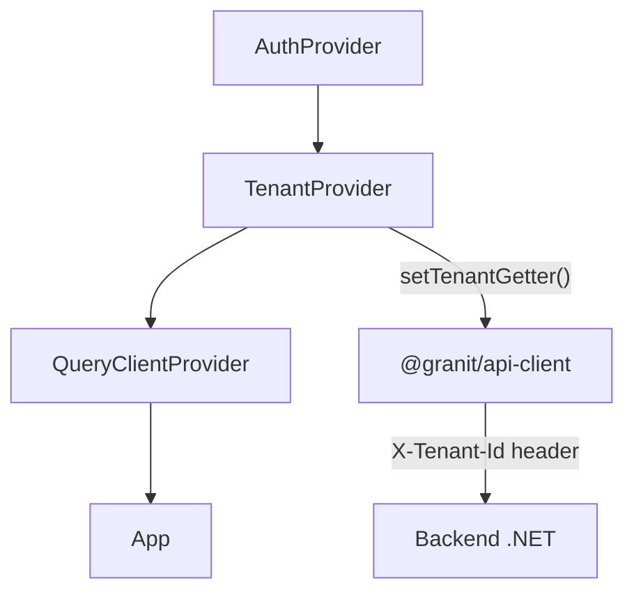

# @granit/react-multi-tenancy

Bindings React pour `@granit/multi-tenancy` — provider, hook `useTenant`,
et intégration Keycloak.

## Pourquoi

- `TenantProvider` centralise la résolution tenant et la rend accessible via contexte React
- Auto-wire du header `X-Tenant-Id` via `@granit/api-client` (`setTenantGetter`)
- `useKeycloakTenantResolvers` simplifie l'intégration Keycloak en une ligne

## Intégration dans une app



### Exemple complet

```tsx
import { TenantProvider, useKeycloakTenantResolvers } from '@granit/react-multi-tenancy';

function AppWithTenant({ children }: { children: ReactNode }) {
  const { tokenParsed } = useAuth(); // contexte auth de l'app
  const resolvers = useKeycloakTenantResolvers({ tokenParsed });

  return <TenantProvider resolvers={resolvers}>{children}</TenantProvider>;
}
```

## API

### `TenantProvider`

Provider React qui résout le tenant via le pipeline de resolvers et expose
le résultat via contexte. Appelle automatiquement `setTenantGetter()` de
`@granit/api-client` pour injecter le header `X-Tenant-Id` sur toutes les
requêtes HTTP.

```tsx
<TenantProvider resolvers={resolvers} options={{ isEnabled: true }}>
  {children}
</TenantProvider>
```

#### Props

| Prop        | Type                        | Description                 |
| ----------- | --------------------------- | --------------------------- |
| `resolvers` | `readonly TenantResolver[]` | Liste ordonnée de resolvers |
| `options`   | `MultiTenancyOptions`       | Options (optionnel)         |
| `children`  | `ReactNode`                 | Contenu enfant              |

### `useTenant(): CurrentTenant`

Hook qui retourne l'état courant du tenant depuis le `TenantProvider` le plus
proche.

```tsx
import { useTenant } from '@granit/react-multi-tenancy';

function TenantBadge() {
  const { tenantId, tenantName, isAvailable } = useTenant();

  if (!isAvailable) return null;

  return <span>{tenantName ?? tenantId}</span>;
}
```

| Champ retourné | Type                  | Description                    |
| -------------- | --------------------- | ------------------------------ |
| `isAvailable`  | `boolean`             | `true` si un tenant est résolu |
| `tenantId`     | `string \| undefined` | ID du tenant courant           |
| `tenantName`   | `string \| undefined` | Nom du tenant courant          |

> **Erreur** : lance une exception si utilisé en dehors d'un `TenantProvider`.

### `useKeycloakTenantResolvers(options): readonly TenantResolver[]`

Hook utilitaire qui crée un tableau de resolvers à partir du token Keycloak
décodé. Retourne un tableau mémoïsé (même référence tant que `tokenParsed`
ne change pas).

```tsx
import { useKeycloakTenantResolvers } from '@granit/react-multi-tenancy';

const resolvers = useKeycloakTenantResolvers({
  tokenParsed: keycloak.tokenParsed,
  claimType: 'tenant_id', // optionnel, défaut
});
```

#### Options

| Option        | Type                                   | Défaut        | Description         |
| ------------- | -------------------------------------- | ------------- | ------------------- |
| `tokenParsed` | `Record<string, unknown> \| undefined` | —             | Payload JWT décodé  |
| `claimType`   | `string`                               | `"tenant_id"` | Nom du claim tenant |

## Resolver personnalisé avec le provider

```tsx
import { TenantProvider } from '@granit/react-multi-tenancy';

import type { TenantResolver } from '@granit/multi-tenancy';

const subdomainResolver: TenantResolver = {
  order: 100,
  name: 'SubdomainResolver',
  resolve() {
    const match = window.location.hostname.match(/^([^.]+)\.app\.example\.com$/);
    return match ? { id: match[1] } : null;
  },
};

function App() {
  const { tokenParsed } = useAuth();
  const jwtResolvers = useKeycloakTenantResolvers({ tokenParsed });
  const resolvers = [subdomainResolver, ...jwtResolvers];

  return (
    <TenantProvider resolvers={resolvers}>
      <MainLayout />
    </TenantProvider>
  );
}
```

Le resolver de sous-domaine (order 100) est prioritaire sur le JWT (order 200).

## Désactiver le multi-tenancy

```tsx
<TenantProvider resolvers={[]} options={{ isEnabled: false }}>
  {children}
</TenantProvider>
```

Quand `isEnabled` est `false`, `useTenant()` retourne toujours
`{ isAvailable: false, tenantId: undefined, tenantName: undefined }`
et `setTenantGetter` n'est pas appelé.

## Types exportés

| Export                              | Type        | Description                    |
| ----------------------------------- | ----------- | ------------------------------ |
| `TenantProvider`                    | `component` | Provider React                 |
| `TenantProviderProps`               | `interface` | Props du provider              |
| `useTenant`                         | `function`  | Hook d'accès au tenant courant |
| `useKeycloakTenantResolvers`        | `function`  | Factory de resolvers Keycloak  |
| `UseKeycloakTenantResolversOptions` | `interface` | Options du hook                |

## Peer dependencies

- `react` ^19.0.0
- `@granit/multi-tenancy` workspace:\*
- `@granit/api-client` workspace:\*
