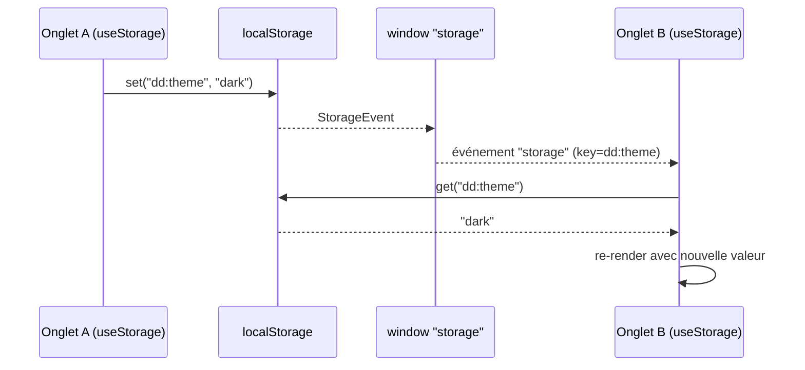

# @granit/storage

Wrapper typé pour `localStorage` et `sessionStorage` avec préfixe automatique `dd:`.

## Pourquoi

- Centralise l'accès au stockage local avec des clés préfixées pour éviter les collisions
- API typée — pas de `JSON.parse` / `JSON.stringify` manuels
- Sérialiseur/désérialiseur personnalisables
- Hook React avec synchronisation cross-tab

## Préfixe des clés

Toutes les clés sont automatiquement préfixées `dd:` (Digital Dynamics).

| Appel | Clé réelle dans le navigateur |
| --- | --- |
| `createStorage('locale')` | `dd:locale` |
| `createStorage('theme')` | `dd:theme` |
| `createStorage('sidebar-open')` | `dd:sidebar-open` |

### Clés réservées

| Clé | Utilisée par | Description |
| --- | --- | --- |
| `dd:locale` | [`@granit/localization`](localization.md) | Langue active de l'utilisateur |

## API

### `createStorage<T>(key, options?): TypedStorage<T>`

Crée un accesseur typé pour une clé de stockage.

```typescript
import { createStorage } from '@granit/storage';

const themeStorage = createStorage<'light' | 'dark'>('theme');
themeStorage.set('dark');     // écrit dans localStorage["dd:theme"]
themeStorage.get();           // 'dark' (ou null si absent/non parseable)
themeStorage.remove();        // supprime la clé
themeStorage.key;             // 'dd:theme' (lecture seule)
```

#### Interface `TypedStorage<T>`

| Méthode / propriété | Type de retour | Description |
| --- | --- | --- |
| `get()` | `T \| null` | Lit la valeur stockée. Retourne `null` si la clé est absente ou si la désérialisation échoue |
| `set(value)` | `void` | Écrit la valeur sérialisée dans le storage |
| `remove()` | `void` | Supprime la clé du storage |
| `key` | `string` (readonly) | La clé préfixée réelle (ex : `dd:theme`) |

#### Options

| Option | Type | Défaut | Description |
| --- | --- | --- | --- |
| `storage` | `'local' \| 'session'` | `'local'` | Backend de stockage |
| `serialize` | `(value: T) => string` | `JSON.stringify` | Sérialiseur personnalisé |
| `deserialize` | `(raw: string) => T` | `JSON.parse` | Désérialiseur personnalisé |

#### Exemple avec sérialiseur personnalisé

```typescript
const dateStorage = createStorage<Date>('last-visit', {
  serialize: (d) => d.toISOString(),
  deserialize: (raw) => new Date(raw),
});
```

#### Exemple avec sessionStorage

```typescript
const tokenStorage = createStorage<string>('csrf-token', { storage: 'session' });
```

### `useStorage<T>(key, defaultValue, options?): [T, (value: T) => void]`

Hook React qui synchronise l'état du composant avec le stockage.

Utilise `useSyncExternalStore` pour des lectures sans déchirement
(tear-free) et des re-rendus automatiques quand la valeur change
(y compris cross-tab via l'événement `storage`).

Accepte les mêmes options que `createStorage` (`storage`, `serialize`, `deserialize`).



```tsx
import { useStorage } from '@granit/storage';

function Sidebar() {
  const [open, setOpen] = useStorage('sidebar-open', false);

  return (
    <nav data-open={open}>
      <button onClick={() => setOpen(!open)}>Toggle</button>
    </nav>
  );
}
```

## Types exportés

| Export | Type | Description |
| --- | --- | --- |
| `createStorage` | `function` | Factory d'accesseur typé avec préfixe `dd:` |
| `useStorage` | `function` | Hook React synchronisé avec le storage |
| `StorageOptions` | `interface` | Options partagées (`storage`, `serialize`, `deserialize`) |
| `TypedStorage` | `interface` | Accesseur retourné par `createStorage` |

## Frontière avec @granit/cookie

| Package | Périmètre | Envoyé au serveur ? |
| --- | --- | --- |
| `@granit/storage` | `localStorage` / `sessionStorage` | Non (client-only) |
| `@granit/cookie` (à venir) | Cookies HTTP | Oui (headers automatiques) |

## Peer dependencies

- `react` ^19.0.0
