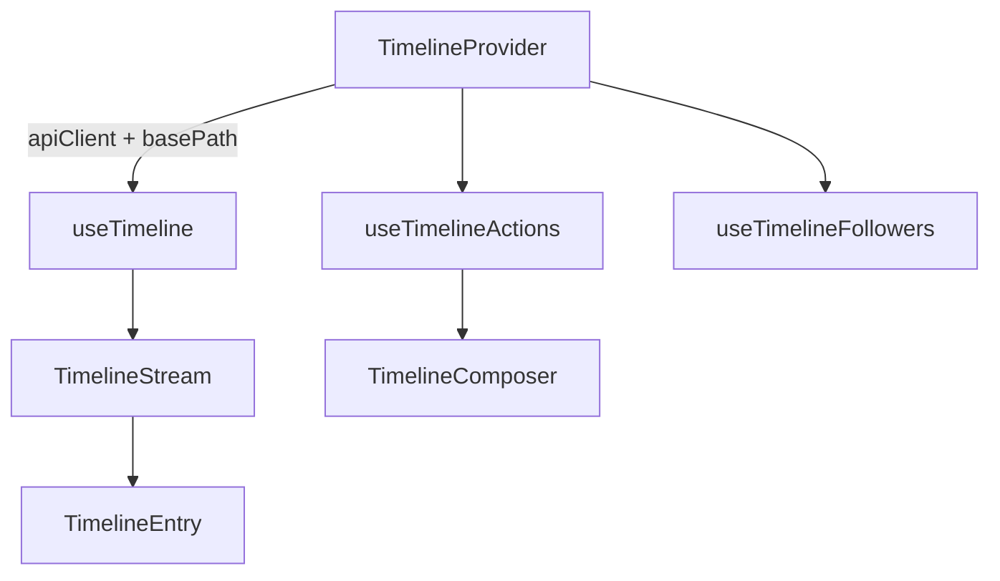

# @granit/timeline

Flux d'activité unifié pour les entités, inspiré du chatter Odoo. Consomme l'API REST `Granit.Timeline.Endpoints` (.NET).

## Pourquoi

- Composant réutilisable pour afficher commentaires, notes internes et logs système
- Réponses threadées avec indentation côté front (`parentEntryId`)
- @Mentions au format `@[Display Name](user:guid)`
- Pagination infinie (infinite scroll)
- Follow/unfollow sur une entité

## Architecture



Le `TimelineProvider` injecte la configuration (instance Axios + chemin de base de l'API) dans tous les hooks enfants via un contexte React.

## Configuration

### `TimelineProvider`

Wrappez les composants qui utilisent les hooks timeline dans un `TimelineProvider` :

```tsx
import { TimelineProvider } from '@granit/timeline';

function App() {
  return (
    <TimelineProvider apiClient={apiClient} basePath="/api/v1/timeline">
      <PatientPage />
    </TimelineProvider>
  );
}
```

| Prop        | Type            | Défaut               | Description                                          |
| ----------- | --------------- | -------------------- | ---------------------------------------------------- |
| `apiClient` | `AxiosInstance` | —                    | Instance Axios configurée (via `@granit/api-client`) |
| `basePath`  | `string`        | `'/api/v1/timeline'` | Préfixe des endpoints REST                           |

## Hooks

### `useTimeline(options): UseTimelineResult`

Charge le flux paginé d'une entité avec support d'infinite scroll.

```tsx
const {
  entries, // TimelineStreamEntry[]
  totalCount, // nombre total d'entrées
  loading, // true au chargement initial
  loadingMore, // true pendant le chargement de la page suivante
  error, // Error | null
  hasMore, // true s'il reste des pages à charger
  loadMore, // charge la page suivante
  refresh, // recharge depuis le début
  addOptimisticEntry, // insère une entrée en tête (optimistic update)
  removeOptimisticEntry, // retire une entrée par id (optimistic update)
} = useTimeline({ entityType: 'Patient', entityId: 'p-1', pageSize: 20 });
```

#### Options

| Option       | Type     | Défaut | Description                         |
| ------------ | -------- | ------ | ----------------------------------- |
| `entityType` | `string` | —      | Type de l'entité (ex : `'Patient'`) |
| `entityId`   | `string` | —      | Identifiant de l'entité             |
| `pageSize`   | `number` | `20`   | Nombre d'entrées par page           |

### `useTimelineActions(options): UseTimelineActionsResult`

Publie ou supprime des entrées dans le flux.

```tsx
const { postEntry, removeEntry, posting, deleting, error } = useTimelineActions({
  entityType: 'Patient',
  entityId: 'p-1',
  onEntryCreated: (entry) => addOptimisticEntry(entry),
  onEntryDeleted: (id) => removeOptimisticEntry(id),
});

await postEntry({ entryType: TimelineEntryType.Comment, body: 'Bonjour !' });
await removeEntry('entry-uuid');
```

#### Options

| Option           | Type              | Description                        |
| ---------------- | ----------------- | ---------------------------------- |
| `entityType`     | `string`          | Type de l'entité                   |
| `entityId`       | `string`          | Identifiant de l'entité            |
| `onEntryCreated` | `(entry) => void` | Callback après création réussie    |
| `onEntryDeleted` | `(id) => void`    | Callback après suppression réussie |

### `useTimelineFollowers(options): UseTimelineFollowersResult`

Gère les abonnements (follow/unfollow) sur une entité.

```tsx
const { followers, isFollowing, follow, unfollow, loading, error } = useTimelineFollowers({
  entityType: 'Patient',
  entityId: 'p-1',
  currentUserId: user.sub,
});
```

#### Options

| Option          | Type      | Description                                               |
| --------------- | --------- | --------------------------------------------------------- |
| `entityType`    | `string`  | Type de l'entité                                          |
| `entityId`      | `string`  | Identifiant de l'entité                                   |
| `currentUserId` | `string?` | ID de l'utilisateur courant (pour calculer `isFollowing`) |

## Composants

### `<TimelineStream />`

Affiche la liste des entrées avec threading (indentation des réponses via `parentEntryId`).

```tsx
<TimelineStream
  entries={entries}
  loading={loading}
  loadingMore={loadingMore}
  hasMore={hasMore}
  onLoadMore={loadMore}
  onReply={(entryId) => setReplyTo(entryId)}
  onDelete={(entryId) => removeEntry(entryId)}
  renderBody={(body) => <MarkdownRenderer content={body} />}
  emptyMessage="Aucune entrée."
/>
```

| Prop           | Type                    | Défaut              | Description                            |
| -------------- | ----------------------- | ------------------- | -------------------------------------- |
| `entries`      | `TimelineStreamEntry[]` | —                   | Liste des entrées                      |
| `loading`      | `boolean`               | `false`             | Affiche un indicateur de chargement    |
| `loadingMore`  | `boolean`               | `false`             | Désactive le bouton « Charger plus »   |
| `hasMore`      | `boolean`               | `false`             | Affiche le bouton « Charger plus »     |
| `onLoadMore`   | `() => void`            | —                   | Callback pour charger la page suivante |
| `onReply`      | `(entryId) => void`     | —                   | Active le bouton « Répondre »          |
| `onDelete`     | `(entryId) => void`     | —                   | Active le bouton « Supprimer »         |
| `renderEntry`  | `(props) => ReactNode`  | —                   | Rendu personnalisé par entrée          |
| `renderBody`   | `(body) => ReactNode`   | texte brut          | Rendu du corps (Markdown, etc.)        |
| `emptyMessage` | `string`                | `'No entries yet.'` | Message si le flux est vide            |

### `<TimelineEntry />`

Entrée individuelle (commentaire, note interne ou log système). Utilisé en interne par `TimelineStream`, mais exporté pour un rendu personnalisé.

### `<TimelineComposer />`

Éditeur de commentaires avec sélecteur de type d'entrée et autocomplétion des @mentions.

```tsx
<TimelineComposer
  onSubmit={(request) => postEntry(request)}
  parentEntryId={replyTo}
  searchMentions={async (query) => searchUsers(query)}
  entryTypes={[TimelineEntryType.Comment, TimelineEntryType.InternalNote]}
  placeholder="Votre commentaire…"
  submitLabel="Envoyer"
/>
```

| Prop             | Type                                      | Défaut                    | Description                             |
| ---------------- | ----------------------------------------- | ------------------------- | --------------------------------------- |
| `onSubmit`       | `(request) => Promise<void>`              | —                         | Callback de soumission                  |
| `parentEntryId`  | `string?`                                 | —                         | ID du parent (réponse threadée)         |
| `entryTypes`     | `TimelineEntryTypeValue[]`                | `[Comment, InternalNote]` | Types d'entrée disponibles              |
| `searchMentions` | `(query) => Promise<MentionSuggestion[]>` | —                         | Recherche d'utilisateurs pour @mentions |
| `placeholder`    | `string`                                  | `'Write a comment…'`      | Placeholder du textarea                 |
| `submitLabel`    | `string`                                  | `'Send'`                  | Label du bouton de soumission           |

#### Format des mentions

Le composer insère les mentions au format : `@[Display Name](user:uuid)`

Ce format est parseable côté serveur pour extraire les IDs des utilisateurs mentionnés.

## Types

### `TimelineEntryType`

```typescript
const TimelineEntryType = {
  Comment: 0, // Commentaire visible par tous
  InternalNote: 1, // Note interne (visibilité restreinte)
  SystemLog: 2, // Log système automatique
} as const;
```

### `TimelineStreamEntry`

```typescript
interface TimelineStreamEntry {
  id: string;
  entityType: string;
  entityId: string;
  entryType: TimelineEntryTypeValue;
  body: string;
  authorId: string;
  authorDisplayName: string;
  parentEntryId: string | null;
  createdAt: string; // ISO 8601
  attachmentBlobIds: string[];
}
```

### `TimelineStreamPage`

```typescript
interface TimelineStreamPage {
  items: TimelineStreamEntry[];
  totalCount: number;
}
```

### `MentionSuggestion`

```typescript
interface MentionSuggestion {
  id: string;
  displayName: string;
}
```

## API REST consommée

| Méthode  | Endpoint                                | Description                     |
| -------- | --------------------------------------- | ------------------------------- |
| `GET`    | `/{entityType}/{entityId}`              | Flux paginé (`?skip=0&take=20`) |
| `POST`   | `/{entityType}/{entityId}/entries`      | Créer une entrée                |
| `DELETE` | `/{entityType}/{entityId}/entries/{id}` | Supprimer une entrée            |
| `POST`   | `/{entityType}/{entityId}/follow`       | S'abonner aux notifications     |
| `DELETE` | `/{entityType}/{entityId}/follow`       | Se désabonner                   |
| `GET`    | `/{entityType}/{entityId}/followers`    | Liste des abonnés               |

Tous les chemins sont relatifs au `basePath` configuré (défaut : `/api/v1/timeline`).

## Exemple complet

```tsx
import {
  TimelineProvider,
  useTimeline,
  useTimelineActions,
  useTimelineFollowers,
  TimelineStream,
  TimelineComposer,
  TimelineEntryType,
} from '@granit/timeline';

function PatientTimeline({ patientId }: { patientId: string }) {
  const timeline = useTimeline({ entityType: 'Patient', entityId: patientId });

  const actions = useTimelineActions({
    entityType: 'Patient',
    entityId: patientId,
    onEntryCreated: timeline.addOptimisticEntry,
    onEntryDeleted: timeline.removeOptimisticEntry,
  });

  const followers = useTimelineFollowers({
    entityType: 'Patient',
    entityId: patientId,
    currentUserId: currentUser.sub,
  });

  return (
    <div>
      <button onClick={followers.isFollowing ? followers.unfollow : followers.follow}>
        {followers.isFollowing ? 'Ne plus suivre' : 'Suivre'}
      </button>

      <TimelineComposer
        onSubmit={actions.postEntry}
        entryTypes={[TimelineEntryType.Comment, TimelineEntryType.InternalNote]}
      />

      <TimelineStream
        entries={timeline.entries}
        loading={timeline.loading}
        loadingMore={timeline.loadingMore}
        hasMore={timeline.hasMore}
        onLoadMore={timeline.loadMore}
        onDelete={actions.removeEntry}
      />
    </div>
  );
}
```

## Peer dependencies

- `axios` — Instance Axios pour les appels API
- `react` ^19.0.0
