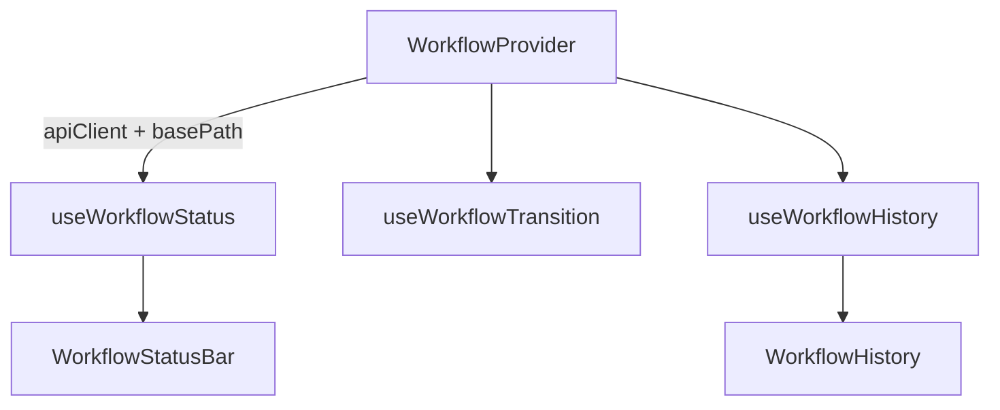

# @granit/workflow

Gestion du cycle de vie (workflow) des entités, avec machine à états finis côté serveur. Consomme l'API REST `Granit.Workflow.Endpoints` (.NET).

## Pourquoi

- Composant réutilisable pour afficher l'état courant et les transitions disponibles
- Barre de statut headless (style Odoo) avec `data-*` attributs pour le styling personnalisé
- Gestion des approbations (routing automatique quand l'utilisateur n'a pas la permission directe)
- Historique des transitions (piste d'audit HDS, INSERT-only)
- Intégrable dans le composant `<Timeline />` comme entrées système

## Architecture



Le `WorkflowProvider` injecte la configuration (instance Axios + chemin de base de l'API) dans tous les hooks enfants via un contexte React.

## Configuration

### `WorkflowProvider`

Wrappez les composants qui utilisent les hooks workflow dans un `WorkflowProvider` :

```tsx
import { WorkflowProvider } from '@granit/workflow';

function App() {
  return (
    <WorkflowProvider apiClient={apiClient} basePath="/api/v1/workflow">
      <DocumentPage />
    </WorkflowProvider>
  );
}
```

| Prop        | Type            | Défaut               | Description                                          |
| ----------- | --------------- | -------------------- | ---------------------------------------------------- |
| `apiClient` | `AxiosInstance` | —                    | Instance Axios configurée (via `@granit/api-client`) |
| `basePath`  | `string`        | `'/api/v1/workflow'` | Préfixe des endpoints REST                           |

## Hooks

### `useWorkflowStatus(options): UseWorkflowStatusResult`

Charge l'état courant et les transitions disponibles pour une entité.

```tsx
const { currentState, transitions, loading, error, refetch } = useWorkflowStatus({
  entityType: 'Document',
  entityId: 'doc-1',
});
```

#### Options

| Option       | Type     | Description                          |
| ------------ | -------- | ------------------------------------ |
| `entityType` | `string` | Type de l'entité (ex : `'Document'`) |
| `entityId`   | `string` | Identifiant de l'entité              |

#### Résultat

| Propriété      | Type                  | Description                                        |
| -------------- | --------------------- | -------------------------------------------------- |
| `currentState` | `string \| null`      | État courant de l'entité                           |
| `transitions`  | `TransitionDto[]`     | Transitions disponibles pour l'utilisateur courant |
| `loading`      | `boolean`             | `true` pendant le chargement                       |
| `error`        | `Error \| null`       | Erreur éventuelle                                  |
| `refetch`      | `() => Promise<void>` | Recharge les données                               |

### `useWorkflowTransition(options): UseWorkflowTransitionResult`

Déclenche une transition sur une entité.

```tsx
const { transition, loading, result, error } = useWorkflowTransition({
  entityType: 'Document',
  entityId: 'doc-1',
  onSuccess: (result) => {
    if (result.outcome === 'ApprovalRequested') {
      toast('Demande d'approbation envoyée');
    }
    refetch();
  },
});

await transition('Published', 'Validé par Dr. Martin');
```

#### Options

| Option       | Type               | Description                       |
| ------------ | ------------------ | --------------------------------- |
| `entityType` | `string`           | Type de l'entité                  |
| `entityId`   | `string`           | Identifiant de l'entité           |
| `onSuccess`  | `(result) => void` | Callback après transition réussie |
| `onError`    | `(error) => void`  | Callback en cas d'erreur          |

#### Résultat

| Propriété    | Type                                                              | Description                    |
| ------------ | ----------------------------------------------------------------- | ------------------------------ |
| `transition` | `(targetState, comment?) => Promise<TransitionResultDto \| null>` | Déclenche la transition        |
| `loading`    | `boolean`                                                         | `true` pendant la transition   |
| `result`     | `TransitionResultDto \| null`                                     | Dernier résultat de transition |
| `error`      | `Error \| null`                                                   | Erreur éventuelle              |

### `useWorkflowHistory(options): UseWorkflowHistoryResult`

Charge l'historique des transitions (piste d'audit HDS).

```tsx
const { history, loading, error, refetch } = useWorkflowHistory({
  entityType: 'Document',
  entityId: 'doc-1',
});
```

#### Options

| Option       | Type      | Défaut | Description                                |
| ------------ | --------- | ------ | ------------------------------------------ |
| `entityType` | `string`  | —      | Type de l'entité                           |
| `entityId`   | `string`  | —      | Identifiant de l'entité                    |
| `enabled`    | `boolean` | `true` | Active/désactive le chargement automatique |

## Composants

### `<WorkflowStatusBar />`

Barre de statut headless (style Odoo). Affiche les états comme des chips et les transitions comme des boutons d'action.

```tsx
<WorkflowStatusBar
  currentState={currentState}
  states={['Draft', 'PendingReview', 'Published', 'Archived']}
  transitions={transitions}
  onTransition={(targetState) => transition(targetState)}
  isLoading={loading}
/>
```

| Prop           | Type                              | Défaut  | Description                                         |
| -------------- | --------------------------------- | ------- | --------------------------------------------------- |
| `currentState` | `string`                          | —       | État courant de l'entité                            |
| `states`       | `string[]`                        | —       | Tous les états possibles (dans l'ordre d'affichage) |
| `transitions`  | `TransitionDto[]`                 | —       | Transitions disponibles                             |
| `onTransition` | `(targetState, comment?) => void` | —       | Callback de transition                              |
| `isLoading`    | `boolean`                         | `false` | Désactive les boutons pendant le chargement         |
| `className`    | `string`                          | —       | Classe CSS optionnelle                              |

#### Attributs `data-*` pour le styling

| Attribut                 | Élément    | Valeurs             | Description                             |
| ------------------------ | ---------- | ------------------- | --------------------------------------- |
| `data-state`             | `<span>`   | nom de l'état       | Identifiant de l'état                   |
| `data-current`           | `<span>`   | `true`/`false`      | L'état est l'état courant               |
| `data-past`              | `<span>`   | `true`/`false`      | L'état a déjà été franchi               |
| `data-target`            | `<button>` | nom de l'état cible | État cible de la transition             |
| `data-requires-approval` | `<button>` | `true`/`false`      | La transition nécessite une approbation |

#### Label d'approbation

Quand `requiresApproval === true` et `allowed === false`, le bouton affiche automatiquement « Demander l'approbation » au lieu du nom de la transition.

### `<WorkflowHistory />`

Affiche l'historique des transitions (piste d'audit).

```tsx
<WorkflowHistory history={history} loading={loading} emptyMessage="Aucune transition." />
```

| Prop           | Type                     | Défaut                  | Description                         |
| -------------- | ------------------------ | ----------------------- | ----------------------------------- |
| `history`      | `TransitionHistoryDto[]` | —                       | Liste des transitions               |
| `loading`      | `boolean`                | `false`                 | Affiche un indicateur de chargement |
| `emptyMessage` | `string`                 | `'No transitions yet.'` | Message si l'historique est vide    |
| `className`    | `string`                 | —                       | Classe CSS optionnelle              |

## Types

### `TransitionOutcome`

```typescript
const TransitionOutcome = {
  Completed: 'Completed', // Transition directe réussie
  ApprovalRequested: 'ApprovalRequested', // Routé vers approbation
  Denied: 'Denied', // Permission refusée, pas de chemin d'approbation
  InvalidTransition: 'InvalidTransition', // Transition non définie
} as const;
```

### `TransitionDto`

```typescript
interface TransitionDto {
  targetState: string; // État cible
  name: string; // Nom affiché (ex : "Publier")
  allowed: boolean; // L'utilisateur a la permission directe
  requiresApproval: boolean; // Nécessite une approbation
}
```

### `WorkflowStatusDto`

```typescript
interface WorkflowStatusDto {
  currentState: string;
  availableTransitions: TransitionDto[];
}
```

### `TransitionResultDto`

```typescript
interface TransitionResultDto {
  succeeded: boolean;
  resultingState: string; // Peut différer du targetState si routé
  outcome: TransitionOutcomeValue;
}
```

### `TransitionRequestDto`

```typescript
interface TransitionRequestDto {
  targetState: string;
  comment?: string; // Commentaire/justification (piste d'audit HDS)
}
```

### `TransitionHistoryDto`

```typescript
interface TransitionHistoryDto {
  previousState: string;
  newState: string;
  transitionedAt: string; // ISO 8601
  transitionedBy: string;
  comment: string | null;
}
```

## API REST consommée

| Méthode | Endpoint                               | Description                                |
| ------- | -------------------------------------- | ------------------------------------------ |
| `GET`   | `/{entityType}/{entityId}/transitions` | État courant + transitions disponibles     |
| `POST`  | `/{entityType}/{entityId}/transition`  | Déclencher une transition                  |
| `GET`   | `/{entityType}/{entityId}/history`     | Historique des transitions (piste d'audit) |

Tous les chemins sont relatifs au `basePath` configuré (défaut : `/api/v1/workflow`).

## Exemple complet

```tsx
import {
  WorkflowProvider,
  useWorkflowStatus,
  useWorkflowTransition,
  useWorkflowHistory,
  WorkflowStatusBar,
  WorkflowHistory,
} from '@granit/workflow';

const STATES = ['Draft', 'PendingReview', 'Published', 'Archived'];

function DocumentWorkflow({ documentId }: { documentId: string }) {
  const status = useWorkflowStatus({
    entityType: 'Document',
    entityId: documentId,
  });

  const { transition, loading: transitioning } = useWorkflowTransition({
    entityType: 'Document',
    entityId: documentId,
    onSuccess: () => status.refetch(),
  });

  const history = useWorkflowHistory({
    entityType: 'Document',
    entityId: documentId,
  });

  if (status.loading) return <div>Chargement…</div>;

  return (
    <div>
      {status.currentState && (
        <WorkflowStatusBar
          currentState={status.currentState}
          states={STATES}
          transitions={status.transitions}
          onTransition={(target) => transition(target)}
          isLoading={transitioning}
        />
      )}

      <h3>Historique</h3>
      <WorkflowHistory
        history={history.history}
        loading={history.loading}
        emptyMessage="Aucune transition enregistrée."
      />
    </div>
  );
}
```

## Peer dependencies

- `axios` — Instance Axios pour les appels API
- `react` ^19.0.0
