# Architecture de granit-front

## Vue d'ensemble

`granit-front` est un monorepo pnpm contenant les packages `@granit/*`, la
contrepartie JavaScript/TypeScript du framework .NET `granit-dotnet`. Les deux
frameworks exposent des contrats symetriques : les types TypeScript dans
`@granit/querying`, `@granit/data-exchange`, `@granit/workflow`, etc. sont le
miroir direct des types C# dans les namespaces `Granit.Querying`,
`Granit.DataExchange`, `Granit.Workflow`, etc.

### Principes fondamentaux

| Principe              | Description                                                                                                                    |
| --------------------- | ------------------------------------------------------------------------------------------------------------------------------ |
| **Source-direct**     | Aucun build step — les packages exportent des fichiers `.ts` consommes directement par Vite                                    |
| **Headless**          | Les packages exposent uniquement des hooks, types et providers — les composants UI vivent dans les applications consommatrices |
| **App-agnostique**    | Aucune logique metier specifique (FHIR, HDS, Capacitor) — uniquement des abstractions reutilisables                            |
| **Peer dependencies** | Les dependances externes sont declarees en `peerDependencies`, jamais en `dependencies`                                        |

### Stack technique

- **TypeScript** 5 (strict) / **React** 19
- **Vitest** 4 / **ESLint** 10 / **Prettier** 3
- **pnpm** workspace / **Node** 24+
- **Conventional Commits** via commitlint + husky

## Diagramme de dependances inter-packages

```mermaid
graph TD
    subgraph "Couche fondation"
        logger["@granit/logger"]
        utils["@granit/utils"]
        storage["@granit/storage"]
        cookies["@granit/cookies"]
    end

    subgraph "Couche infrastructure"
        api["@granit/api-client"]
        react-authn["@granit/react-authentication"]
        react-authz["@granit/react-authorization"]
        localization["@granit/localization"]
        logger-otlp["@granit/logger-otlp"]
        cookies-klaro["@granit/cookies-klaro"]
        tracing["@granit/tracing"]
        error-boundary["@granit/error-boundary"]
    end

    subgraph "Couche metier"
        querying["@granit/querying"]
        data-exchange["@granit/data-exchange"]
        workflow["@granit/workflow"]
        timeline["@granit/timeline"]
        notifications["@granit/notifications"]
    end

    %% Dependances internes @granit
    react-authn --> api
    localization --> storage
    logger-otlp --> logger
    cookies-klaro --> cookies
    error-boundary --> logger
    querying --> utils
    data-exchange --> utils
    timeline --> querying
    notifications --> querying

    %% Dependances externes cles
    utils -.-> clsx["clsx"]
    utils -.-> tw["tailwind-merge"]
    utils -.-> datefns["date-fns"]
    api -.-> axios["axios"]
    react-authn -.-> keycloak["keycloak-js"]
    querying -.-> tanstack["@tanstack/react-query"]
    data-exchange -.-> tanstack
    notifications -.-> signalr["@microsoft/signalr"]
    tracing -.-> otel["@opentelemetry/*"]
    logger-otlp -.-> otel
    cookies-klaro -.-> klaro["klaro"]
    localization -.-> i18next["i18next"]

    style logger fill:#e8f5e9
    style utils fill:#e8f5e9
    style storage fill:#e8f5e9
    style cookies fill:#e8f5e9
    style api fill:#e3f2fd
    style react-authn fill:#e3f2fd
    style react-authz fill:#e3f2fd
    style localization fill:#e3f2fd
    style logger-otlp fill:#e3f2fd
    style cookies-klaro fill:#e3f2fd
    style tracing fill:#e3f2fd
    style error-boundary fill:#e3f2fd
    style querying fill:#fff3e0
    style data-exchange fill:#fff3e0
    style workflow fill:#fff3e0
    style timeline fill:#fff3e0
    style notifications fill:#fff3e0
```



### Legende

- **Vert** (fondation) : packages sans dependance interne `@granit`
- **Bleu** (infrastructure) : packages dependant d'un package fondation
- **Orange** (metier) : packages implementant une fonctionnalite metier

## Pattern vertical slice

Chaque package metier suit une structure en tranches verticales :

```text
packages/@granit/<package>/src/
  types/           # Contrats TypeScript (miroir des types .NET)
  api/             # Fonctions d'appel API (axios)
  hooks/           # React hooks (logique metier)
  providers/       # React context providers
  utils/           # Utilitaires internes au package
  __tests__/       # Tests unitaires (Vitest)
  index.ts         # Point d'entree unique (re-exports publics)
```

Ce decoupage reflete le flux de donnees :

```text
types/ → api/ → hooks/ → providers/
```

1. **types/** definit le contrat de donnees (aligne avec le backend .NET)
2. **api/** encapsule les appels HTTP via `axios`
3. **hooks/** orchestre le data fetching (souvent via `@tanstack/react-query`)
   et expose la logique metier
4. **providers/** fournit le contexte React pour les composants consommateurs

Les packages fondation (`logger`, `utils`, `storage`, `cookies`) sont plus
simples et n'ont pas necessairement toutes ces couches.

## Consommation par les applications

Les applications `guava-front` et `guava-admin` consomment les packages
`@granit/*` via le protocole `pnpm link:` combine avec des alias Vite.

### Configuration dans l'application consommatrice

**package.json** (extrait) :

```json
{
  "dependencies": {
    "@granit/react-authentication": "link:../../granit-front/packages/@granit/react-authentication",
    "@granit/querying": "link:../../granit-front/packages/@granit/querying"
  }
}
```

**vite.config.ts** (extrait) :

```typescript
export default defineConfig({
  resolve: {
    alias: {
      '@granit/react-authentication': resolve(
        '../../granit-front/packages/@granit/react-authentication/src'
      ),
      '@granit/querying': resolve('../../granit-front/packages/@granit/querying/src'),
    },
  },
});
```

### Flux de resolution

```text
import { useQueryEndpoint } from '@granit/querying'
  → Vite alias → packages/@granit/querying/src/index.ts
  → TypeScript source → transpile a la volee par Vite
  → pas de dist/, pas de build intermediaire
```

Cette approche **source-direct** offre plusieurs avantages :

- **Hot Module Replacement** instantane sur le code framework
- **Pas de build watch** a maintenir pour le monorepo
- **Source maps** directes vers le code original
- **Refactoring** sans friction entre framework et application

### Publication npm

Pour la distribution hors development local, les packages disposent d'une
configuration `publishConfig` avec des exports pre-build (`dist/`) et un
registre npm GitLab prive. Le build est effectue par `tsup`.

## Relation avec granit-dotnet

`granit-front` est le pendant frontend du framework .NET `granit-dotnet`. Les
deux frameworks evoluent en tandem :

| granit-dotnet (.NET)         | granit-front (TypeScript)                  |
| ---------------------------- | ------------------------------------------ |
| `Granit.Querying`            | `@granit/querying`                         |
| `Granit.DataExchange.Export` | `@granit/data-exchange` (export)           |
| `Granit.DataExchange.Import` | `@granit/data-exchange` (import)           |
| `Granit.Workflow`            | `@granit/workflow`                         |
| `Granit.Notifications`       | `@granit/notifications`                    |
| `Granit.Timeline`            | `@granit/timeline`                         |
| Controllers .NET             | Endpoints consommes par `api/`             |
| `ProblemDetails`             | `ProblemDetails` dans `@granit/api-client` |
| `PagedResult<T>`             | `PagedResult<T>` dans `@granit/api-client` |

### Contrat partage

Les types TypeScript dans `types/` de chaque package sont le miroir fidele des
DTOs C# cote backend. Toute modification d'un contrat .NET doit etre propagee
dans le type TypeScript correspondant, et inversement.

### Pagination

La pagination utilise le modele `page`/`pageSize` (et non `skip`/`take`),
aligne avec le `PagedResult<T>` du backend .NET. Le hook `useQueryEndpoint`
de `@granit/querying` gere automatiquement la conversion.
